# Björklunda Admin Lab

**Name:** Vulkan
**GitHub:** TheBoochy
**Project:** Voluntary portfolio lab based on Björklunda kommun IT technician case
**Focus:** RHEL, Windows Server, Active Directory, Identity Management, scripting, documentation and administration

---

## Work log

### 2026-06-11

**Worked on:**
Initial project setup, Git repository structure, signature scripts and GitHub remote setup.

**What I did:**
Created the project folder, initialized Git, created the folder structure, started the main Markdown logbook, created signature scripts for Linux and Windows Server, and pushed the repository to GitHub.

**Problems and solutions:**
I first had trouble finding the correct project folder because Windows showed both OneDrive Documents and the local Documents folder. I solved this by using the full path to the project folder: `C:\Users\rband\Documents\Bjorklunda-Admin-Lab`.

**Decisions I made:**
I chose to use the repository name `Bjorklunda-Admin-Lab` because this is a voluntary portfolio project and not a formal school submission.

**Sources I used:**

* School assignment PDF: Case IT-tekniker på Björklunda kommun

---

### 2026-06-20

**Worked on:**
RHEL Identity Management installation, verification and IdM account automation on `srv-idm01`, and Windows Server shared folders and permissions on `srv-dc01`.

**What I did:**
I configured `srv-idm01` as a RHEL Identity Management server with integrated DNS. I installed the required IdM packages from a local RHEL ISO repository because the server was not registered with Red Hat Subscription Manager. After installation, I verified IdM services, Kerberos authentication, IPA commands, DNS forward and reverse lookups, and firewall services.

I also added Bash scripts for IdM account management. The scripts create Linux IdM users, IdM groups and group memberships, and then verify the result with IPA commands.

After completing the IdM scripting work, I continued with shared folders on `srv-dc01`. I created department folders for IT, HR, Finance and Education, shared them with SMB, checked the share list, checked share access, applied NTFS permissions to the matching Active Directory groups and verified that the shares were reachable through the network path `\\srv-dc01`.

**Problems and solutions:**
The first problem was that `dnf` could not install packages because no Red Hat repositories were available. I solved this by using the mounted RHEL ISO as a local package repository for BaseOS and AppStream.

The second issue was that `ipactl status` required root permissions. I solved this by running the command with `sudo`.

The firewall initially only showed `cockpit`, `dhcpv6-client`, and `ssh`. I added the required IdM-related services permanently and reloaded the firewall.

During the IdM scripting part, I first tried to run Linux commands such as `chmod`, `kinit` and the Bash scripts directly in Windows PowerShell. This did not work because those commands must be run inside the Linux server. I solved this by using `scp` from Windows to copy the scripts to `srv-idm01`, then using `ssh` to connect to the server and run the Linux commands there.

The first script versions also failed because the IdM group names used symbols that were rejected by the `ipa group-add` command. I solved this by changing the IdM group and user names to simple lowercase alphanumeric names.

Another problem was that the Bash variable name `GROUPS` conflicted with Bash's built-in `GROUPS` variable. That built-in variable contains Linux group IDs for the current user, which caused the verification script to try to check groups such as `1000` and `10`. I solved this by renaming the script variable to `IDM_GROUPS`.

During the Windows share configuration, pasted PowerShell commands were corrupted inside the VM console. For example, dashes and quotes were converted into incorrect characters. I solved this by creating the shares through Server Manager and by typing short verification commands manually in PowerShell instead of pasting long commands.

**Decisions I made:**
I used integrated DNS on the IdM server because IdM depends heavily on correct DNS for Kerberos, host records and service discovery. I also kept the server inside the VMware NAT lab network to keep the environment isolated.

For the IdM script usernames and group names, I chose simple lowercase alphanumeric names to avoid naming problems in IdM and make the scripts reliable.

For the shared folders, I used separate department shares and group-based permissions. This makes access easier to manage because permissions can be assigned to groups instead of directly to individual users.

**Sources I used:**

* Red Hat documentation about RHEL Identity Management
* Red Hat documentation about firewalld
* RHEL installation ISO packages
* Microsoft documentation about SMB shares and NTFS permissions
* Microsoft documentation about Active Directory security groups

---

## Part 1 — Preparation and repository setup

I created the project folder `Bjorklunda-Admin-Lab` on my Windows computer and initialized it as a Git repository.

The folder structure was created with:

* `screenshots/` for screenshots and evidence
* `scripts/` for Bash and PowerShell scripts
* `data/` for CSV and input files
* `results/` for output and result files

The purpose of this structure is to keep documentation, scripts, screenshots and result files separated and easy to find.

I created the first screenshot showing the initial Git commit history.

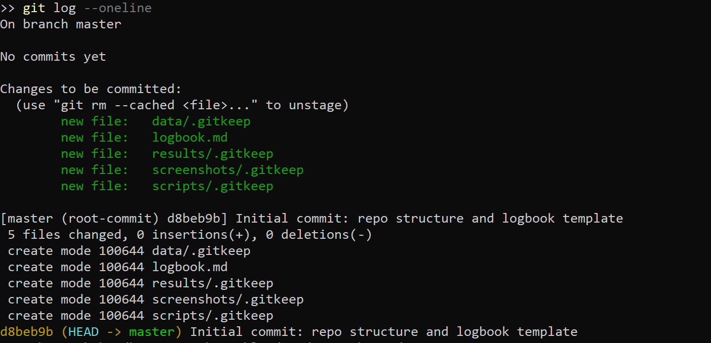

I created two signature scripts:

* `scripts/signature.sh` for Linux servers
* `scripts/signature.ps1` for Windows Server

The purpose of the signature scripts is to show name, email, timestamp, hostname and IP address in screenshots, so each screenshot can be connected to the correct server and moment.

The Linux script is used on RHEL servers to show my name, email, timestamp, hostname and IP address before taking screenshots.

The Windows PowerShell script is used on Windows Server for the same purpose.

The second commit was created with the message:

`Complete part 1: setup and signature scripts`

The Git history showed two commits, which confirmed that the initial repository setup and Part 1 signature scripts were saved in version control.

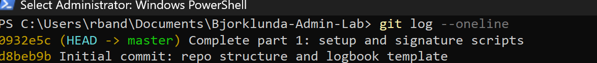

The local Git repository was connected to GitHub using a remote called `origin`.

The branch was renamed to `main`, and the project was pushed to GitHub.

Commands used:

```powershell
git branch -M main
git remote add origin https://github.com/TheBoochy/Bjorklunda-Admin-Lab.git
git push -u origin main
```

The command `git branch -M main` renamed the local branch to `main`.

The command `git remote add origin ...` connected the local repository to the GitHub repository.

The command `git push -u origin main` uploaded the local commits to GitHub and connected the local `main` branch to the GitHub `main` branch.

After pushing, `git status` showed that the working tree was clean and up to date with `origin/main`.

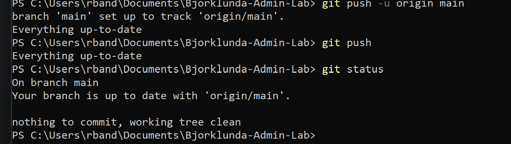

---

## Part 2 — Planning

In this part I planned the server environment before starting the installation. The environment will contain three servers: one RHEL application server, one RHEL Identity Management server, and one Windows Server domain controller.

### Server roles

| Server        | Operating system                                     | Purpose                                                                                                          |
| ------------- | ---------------------------------------------------- | ---------------------------------------------------------------------------------------------------------------- |
| `srv-linux01` | Red Hat Enterprise Linux                             | Application server for Linux services and applications. It will later authenticate users against the IdM server. |
| `srv-idm01`   | Red Hat Enterprise Linux with Identity Management    | Central identity server for Linux users, SSH authentication, groups and access policies.                         |
| `srv-dc01`    | Windows Server with Active Directory Domain Services | Windows domain controller for Windows users, computers, groups and Group Policy.                                 |

### Documentation questions

**What does Red Hat recommend for the `/boot` partition size?**
For this lab I will use a separate `/boot` partition of 1 GB, which also matches the minimum requirement in the assignment. The `/boot` partition stores files required to boot the operating system, such as the kernel and bootloader files.

**What is the difference between XFS and ext4?**
XFS is the default filesystem in Red Hat Enterprise Linux and is designed for scalability, performance and large filesystems. ext4 is also a common Linux filesystem and is familiar from older Linux systems, but it has lower supported limits for filesystem and file sizes compared with XFS. Because this is a RHEL server lab, I will use XFS for the Linux partitions.

**What is RHEL IdM and what is it used for?**
RHEL Identity Management, IdM, is used to centralize Linux identity services. It can manage users, groups, authentication, authorization policies and access control for Linux systems. In this lab, `srv-idm01` will be used as the central identity server for the Linux environment.

**One thing I did not fully understand at first:**
At first I did not fully understand why `/home` should be separated from `/`. I researched it and understood that separating `/home` can help protect user files and settings if the root filesystem has problems or needs to be reinstalled.

### Sources used

* Red Hat documentation about RHEL installation and manual partitioning
* Red Hat documentation about XFS and ext4 filesystems
* Red Hat documentation about Identity Management
* Microsoft Learn documentation about Active Directory Domain Services

### Planned partition layout for `srv-linux01`

| Mount point |  Size | Filesystem | Motivation                                                                                                                                  |
| ----------- | ----: | ---------- | ------------------------------------------------------------------------------------------------------------------------------------------- |
| `/boot`     |  1 GB | XFS        | Stores boot files required to start the system.                                                                                             |
| `/`         | 25 GB | XFS        | Stores the operating system, services and installed packages. I chose more than the minimum because this server may later run applications. |
| `/home`     | 10 GB | XFS        | Stores user files and personal settings. Keeping it separate makes the layout easier to manage.                                             |
| `swap`      |  2 GB | swap       | Provides extra virtual memory if RAM becomes pressured.                                                                                     |

### Planned partition layout for `srv-idm01`

| Mount point |  Size | Filesystem | Motivation                                                                                                                                                                                    |
| ----------- | ----: | ---------- | --------------------------------------------------------------------------------------------------------------------------------------------------------------------------------------------- |
| `/boot`     |  1 GB | XFS        | Stores boot files required to start the system.                                                                                                                                               |
| `/`         | 35 GB | XFS        | IdM is more important than a normal application server because it handles identity, authentication and related services. I chose a larger root partition for packages, logs and service data. |
| `/home`     | 15 GB | XFS        | Gives more room for administrator files and future user-related data.                                                                                                                         |
| `swap`      |  4 GB | swap       | Gives more safety margin because the IdM server provides central authentication services.                                                                                                     |

### Network planning

All three servers will be placed in the same lab network so that they can communicate with each other.

Planned hostnames:

| Server                    | Hostname                       |
| ------------------------- | ------------------------------ |
| Linux application server  | `srv-linux01.bjorklunda.local` |
| RHEL IdM server           | `srv-idm01.bjorklunda.local`   |
| Windows domain controller | `srv-dc01.bjorklunda.local`    |

Planned network mode in VMware: NAT.

I chose NAT because it gives the virtual machines network access through the host computer while keeping the lab separated from the rest of the physical network. This is safer for a school and portfolio lab because the servers can communicate in the virtual network without exposing everything directly to the home network.

---

## Part 3 — Linux server installation

I created and installed the RHEL server `srv-linux01`.

The server was installed with the hostname:

`srv-linux01.bjorklunda.local`

I used VMware NAT networking because it keeps the lab environment separated from the physical network while still allowing internet access through the host computer.

The static network configuration for `srv-linux01` is:

| Setting    | Value                          |
| ---------- | ------------------------------ |
| IP address | `192.168.80.10/24`             |
| Gateway    | `192.168.80.2`                 |
| DNS        | `192.168.80.2`                 |
| Hostname   | `srv-linux01.bjorklunda.local` |

### Installation screenshots

The manual partitioning screen was saved as:

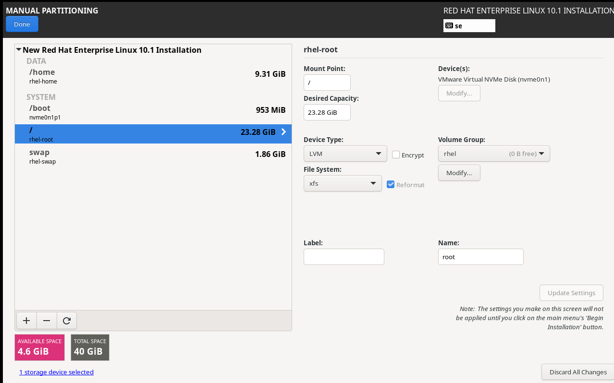

The network and hostname configuration screen was saved as:

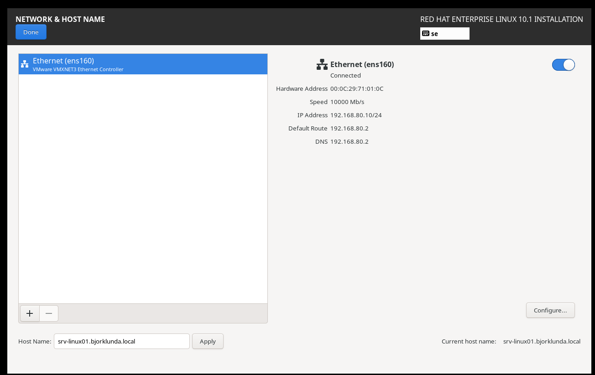

### Verification commands

I verified the installation with these commands:

```bash
lsblk
df -h
ip addr show
hostnamectl
cat /etc/os-release
```

The command `lsblk` showed the disk and partition layout. This confirmed that the server disk was divided into the planned partitions.

The command `df -h` showed mounted filesystems and disk usage in a human-readable format. This confirmed that the partitions were mounted correctly.

The command `ip addr show` showed the network interfaces and IP addresses. This confirmed that `srv-linux01` had the static IP address `192.168.80.10/24`.

The command `hostnamectl` showed the configured hostname and system information. This confirmed that the hostname was set to `srv-linux01.bjorklunda.local`.

The command `cat /etc/os-release` showed the installed operating system version. This confirmed that the server is running Red Hat Enterprise Linux 10.1.

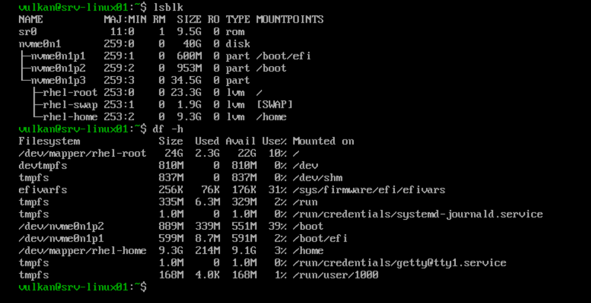

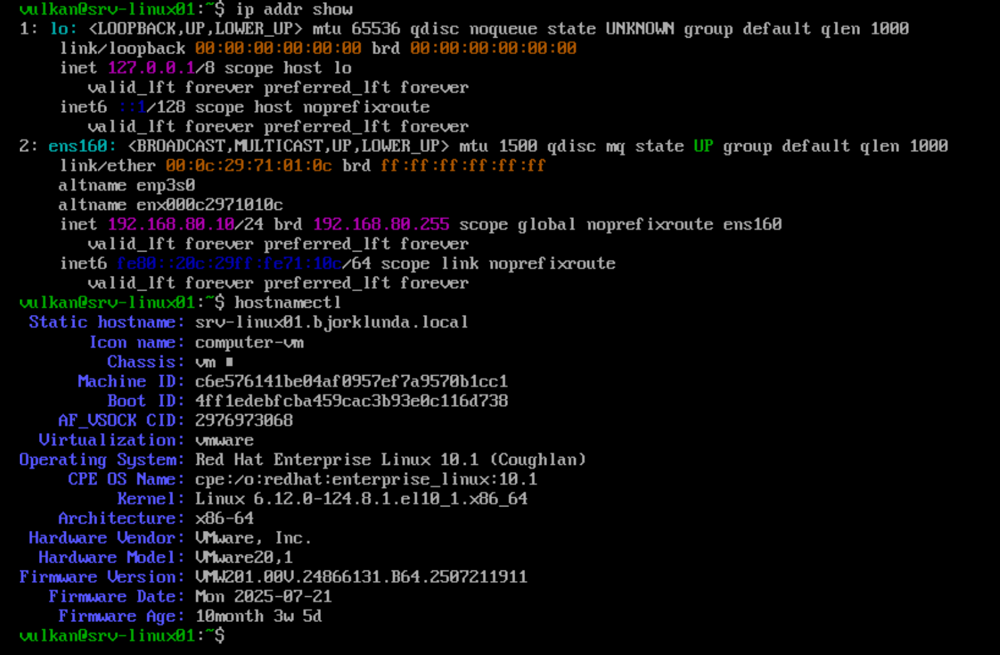

### Signature script activation

I copied the Linux signature script from my Windows host to `srv-linux01` using `scp`.

Command used from the Windows host:

```powershell
scp scripts/signature.sh vulkan@192.168.80.10:~/signature.sh
```

The command `scp` copies files securely over SSH. I used it to copy `signature.sh` from my local `scripts/` folder to the home folder of the user `vulkan` on `srv-linux01`.

On `srv-linux01`, I made the script executable with:

```bash
chmod +x ~/signature.sh
```

The command `chmod +x` gives the script permission to run as a program.

I tested the script with:

```bash
~/signature.sh
```

The script printed my name, email, timestamp, hostname and IP address.

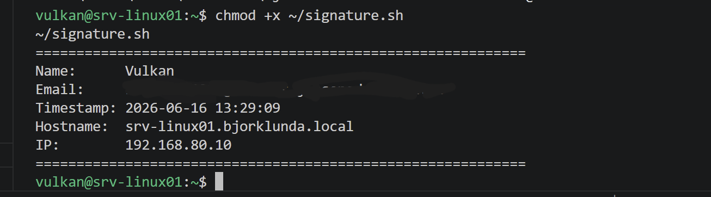

### Running services and listening ports

I checked which services were running on `srv-linux01` with:

```bash
~/signature.sh
systemctl list-units --type=service --state=running --no-pager
```

The command `systemctl list-units --type=service --state=running` lists active systemd services. This shows which background services are currently running on the server.

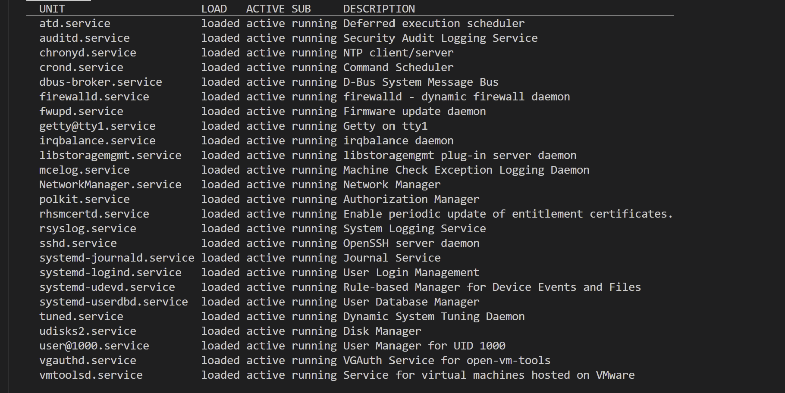

I checked listening TCP ports with:

```bash
~/signature.sh
ss -tlnp
```

The command `ss -tlnp` shows TCP ports that are listening for incoming connections. The output showed that SSH is listening on port `22`, and Cockpit is listening on port `9090`.

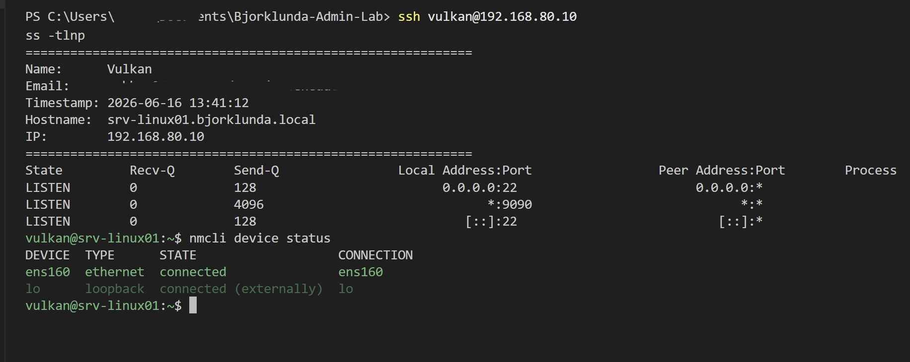

I checked the network device status with:

```bash
nmcli device status
```

The output showed that `ens160` is an Ethernet interface and that it is connected. The `lo` interface is the local loopback interface, which the system uses to communicate with itself.

### Service questions

**Three running services and what they do**

| Service                  | Explanation                                                                                                                                            |
| ------------------------ | ------------------------------------------------------------------------------------------------------------------------------------------------------ |
| `sshd.service`           | This is the OpenSSH server service. It allows remote login to the server through SSH. This is needed so administrators can manage the server remotely. |
| `NetworkManager.service` | This manages network connections and network configuration. It is needed so the server can use its IP address, gateway and DNS settings.               |
| `firewalld.service`      | This manages firewall rules. It is needed to control which network traffic is allowed to reach the server.                                             |

**Which port does SSH listen on and what is it used for?**
SSH listens on TCP port `22`. It is used for secure remote login and administration of the server.

**What would happen if a critical service was stopped?**
If a critical service was stopped, parts of the server could stop working. For example, if `sshd.service` stopped, remote SSH login would no longer work. If `NetworkManager.service` stopped or was misconfigured, the server could lose network connectivity.

**How can I find out which services are critical?**
I can check service status with `systemctl status service-name`, read service descriptions with `systemctl cat service-name`, check logs with `journalctl -u service-name`, and look at what other services depend on it with `systemctl list-dependencies service-name`.

---

### Troubleshooting checks

I performed troubleshooting checks on `srv-linux01` to verify that important server functions were working correctly.

### SSH service check

Command used:

```bash
~/signature.sh
systemctl status sshd --no-pager
```

The command `systemctl status sshd` checks the status of the OpenSSH server service. SSH is used for secure remote administration of the server.

In the output, I looked for `active (running)`, which means that the SSH service is started and working.

If SSH was stopped, the output would show `inactive`, `failed` or `dead`. To start SSH again, I would use:

```bash
sudo systemctl start sshd
```

To make sure SSH starts automatically after reboot, I would use:

```bash
sudo systemctl enable sshd
```

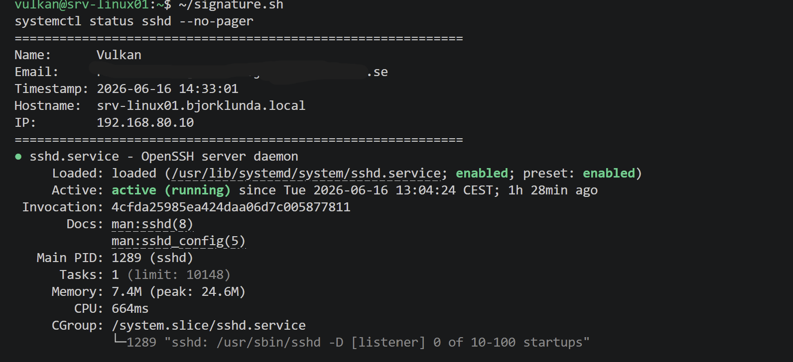

### Hostname check

Command used:

```bash
~/signature.sh
hostnamectl
```

The command `hostnamectl` shows the system hostname and basic system information.

The output confirmed that the static hostname was set to:

`srv-linux01.bjorklunda.local`

If the hostname was wrong, it could cause problems with DNS, certificates, authentication and communication with other servers. To correct the hostname, I would use:

```bash
sudo hostnamectl set-hostname srv-linux01.bjorklunda.local
```

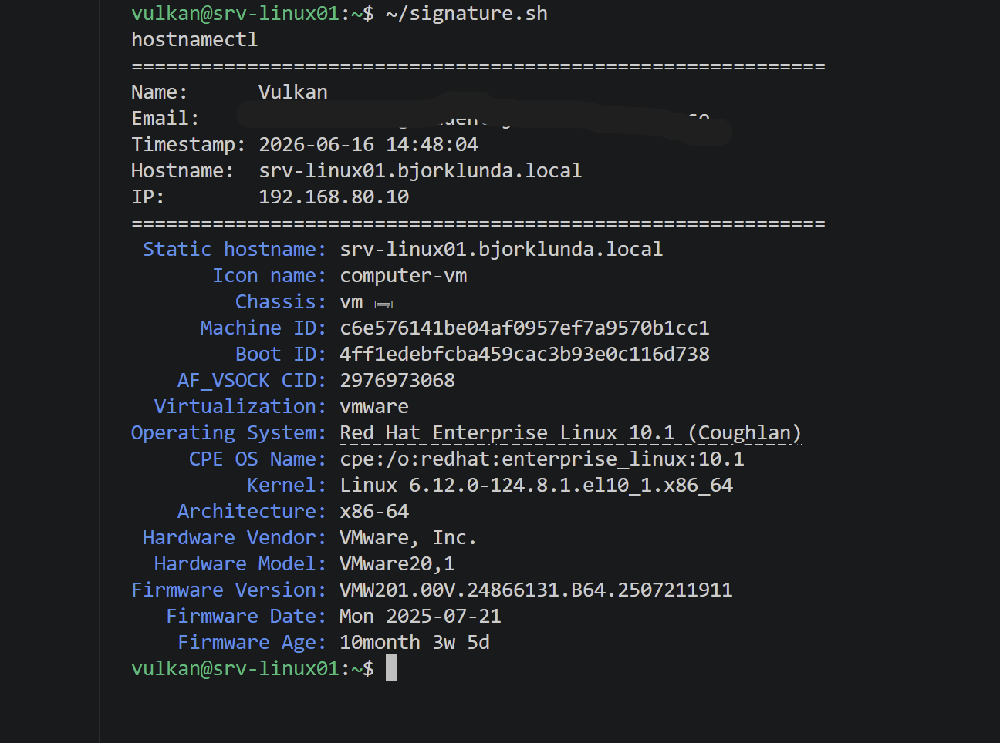

### IP address check

Command used:

```bash
~/signature.sh
ip addr show ens160
```

The command `ip addr show ens160` shows IP address information for the network interface `ens160`.

The output confirmed that the server had the planned static IP address:

`192.168.80.10/24`

If the IP address was missing or incorrect, the server might not be reachable on the network. To troubleshoot this, I would check the NetworkManager connection with:

```bash
nmcli connection show
```

Then I would correct the IP settings with `nmcli` or through the installer/network configuration.

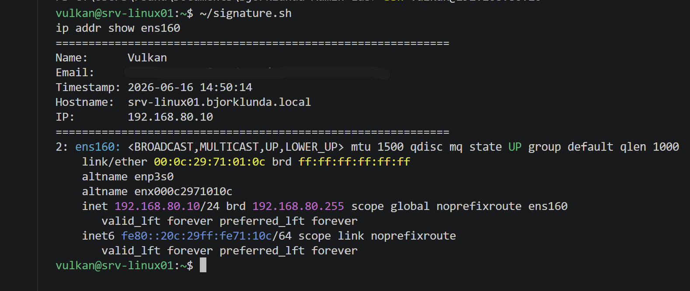

### Partition and mount check

Command used:

```bash
~/signature.sh
lsblk
df -h
```

The command `lsblk` shows the disk and partition layout.

The command `df -h` shows mounted filesystems and disk usage in a human-readable format.

The output confirmed that the planned partitions and mount points were present, including `/`, `/home`, `/boot` and `/boot/efi`.

If a partition was mounted in the wrong place, files could be stored on the wrong filesystem or services could fail to find their data. I would troubleshoot this by checking `/etc/fstab`, using `lsblk`, `df -h`, and testing mounts with:

```bash
sudo mount -a
```

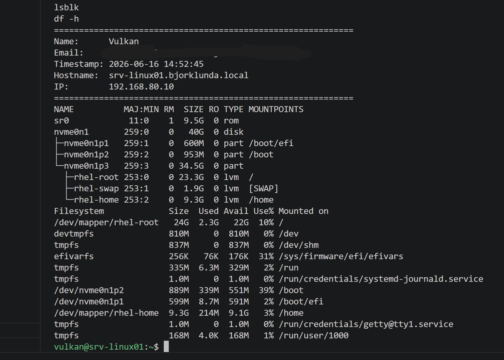

### Network connectivity check

Command used:

```bash
~/signature.sh
ping -c 4 192.168.80.2
ping -c 4 8.8.8.8
```

The command `ping -c 4 192.168.80.2` tested connectivity to the VMware NAT gateway.

The command `ping -c 4 8.8.8.8` tested internet connectivity by IP address.

Both tests showed `0% packet loss`, which means the server could reach both the local gateway and the internet.

If the gateway ping failed, I would check the IP address, gateway, subnet mask and VMware NAT settings.

If the gateway ping worked but the internet ping failed, I would check NAT, firewall settings and DNS/internet access from the host computer.

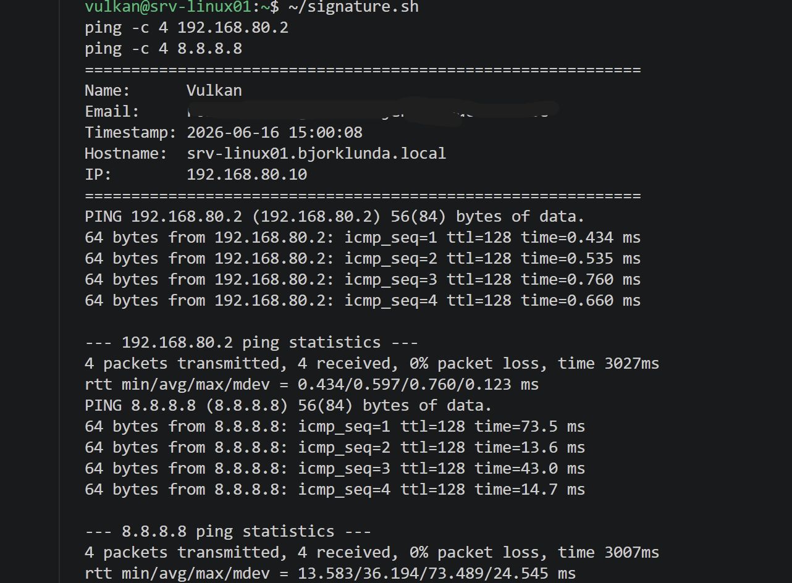

### VM snapshot after Part 3

After completing the installation, verification, service checks and troubleshooting checks for `srv-linux01`, I shut down the server cleanly and created a VMware snapshot.

Snapshot name:

`Part 3 complete - srv-linux01 installed and verified`

The purpose of this snapshot is to create a safe rollback point before continuing with Windows Server, Active Directory and RHEL IdM. If a later configuration breaks the lab environment, I can restore `srv-linux01` to this working state instead of reinstalling it.

The snapshot was taken after confirming:

- RHEL 10.1 was installed
- Static IP address `192.168.80.10/24` was configured
- Hostname `srv-linux01.bjorklunda.local` was configured
- SSH was working
- The signature script was working
- Running services and listening ports were checked
- Troubleshooting checks were completed

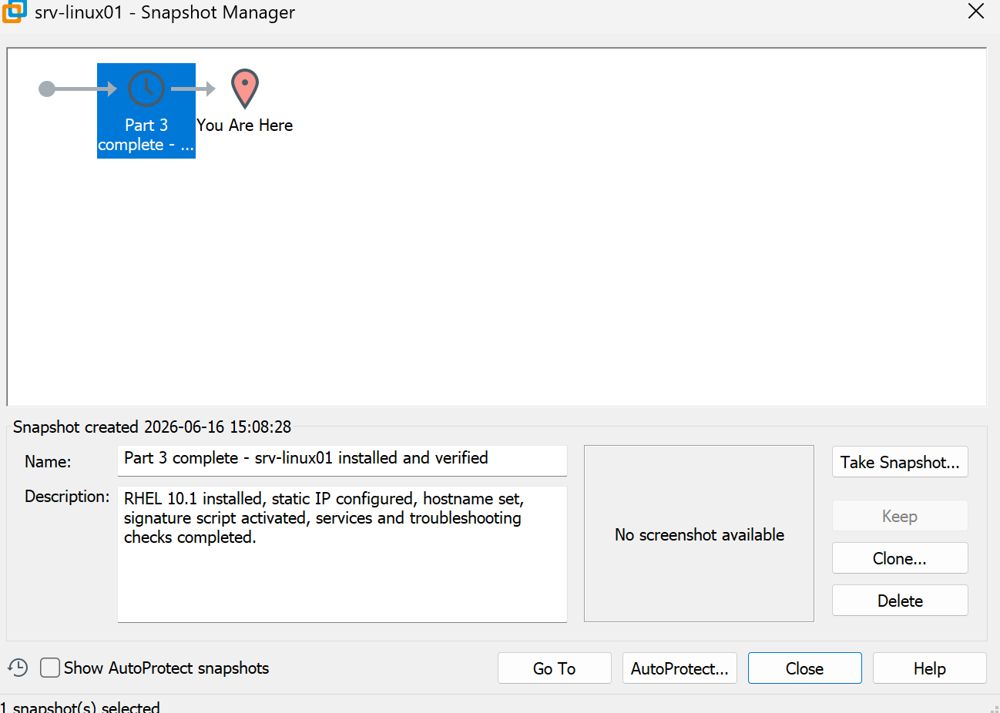

## Part 4 — Windows Server and Active Directory

In this part I installed and configured the Windows Server domain controller `srv-dc01`.

The server was installed with Windows Server 2025 and configured as the Windows domain controller for the lab environment.

### Windows Server installation

I created a VMware virtual machine for `srv-dc01` with the following settings:

| Setting          | Value               |
| ---------------- | ------------------- |
| VM name          | `srv-dc01`          |
| Operating system | Windows Server 2025 |
| Memory           | 4 GB                |
| Processors       | 2                   |
| Disk             | 60 GB               |
| Network mode     | NAT                 |

The Windows Server installer created the required system, reserved and primary partitions automatically.

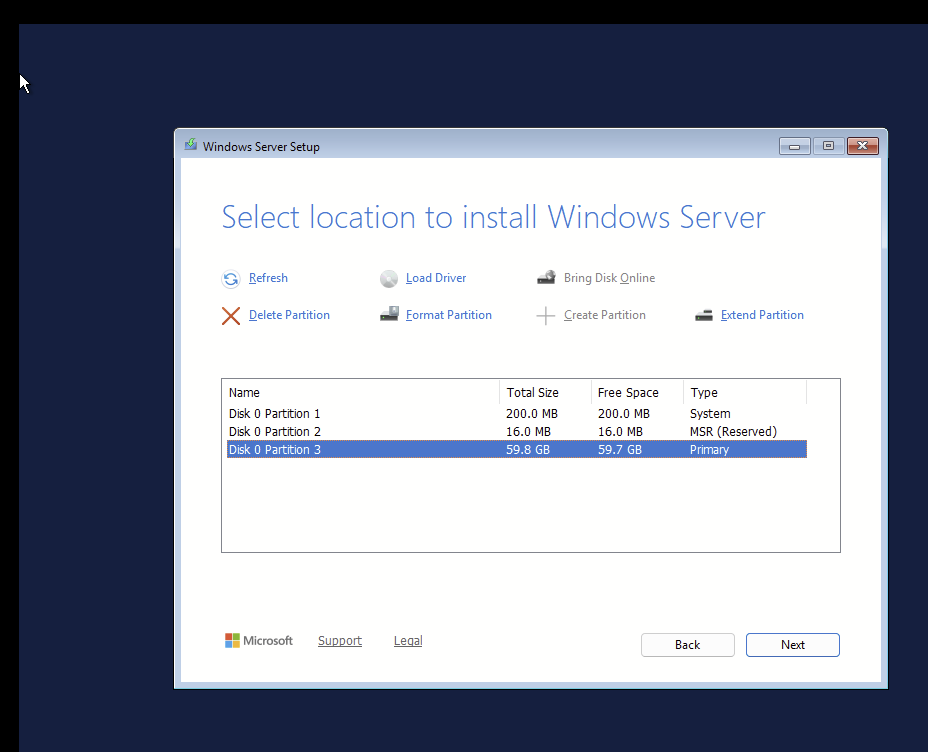

### Hostname and network configuration

After installation, I renamed the server to:

`srv-dc01`

I configured the server with a static IP address so that it can be used reliably as a domain controller and DNS server.

Network configuration:

| Setting         | Value           |
| --------------- | --------------- |
| Hostname        | `srv-dc01`      |
| IP address      | `192.168.80.12` |
| Subnet mask     | `255.255.255.0` |
| Default gateway | `192.168.80.2`  |
| DNS server      | `192.168.80.12` |

The DNS server was set to `192.168.80.12` because the server will run DNS for the Active Directory domain.

The configuration was verified with:

```powershell
ipconfig /all
```

The command `ipconfig /all` shows the full network configuration, including hostname, IP address, gateway and DNS server.

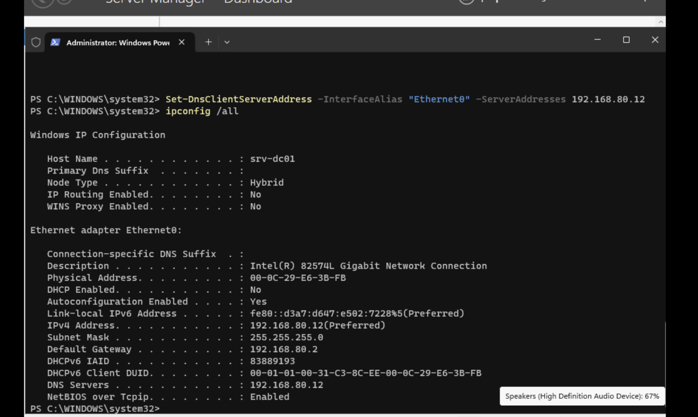

### Windows signature script

I created a Windows PowerShell signature script on `srv-dc01`.

Script location:

`C:\Scripts\signature.ps1`

The script prints my chosen portfolio name, email placeholder, timestamp, hostname and IP address.

I allowed the script to run in the current PowerShell session with:

```powershell
Set-ExecutionPolicy -Scope Process -ExecutionPolicy Bypass
```

The command `Set-ExecutionPolicy` changes PowerShell script execution rules.

The option `-Scope Process` means the change only applies to the current PowerShell window.

The option `-ExecutionPolicy Bypass` allows the script to run for this session.

I tested the script with:

```powershell
C:\Scripts\signature.ps1
```

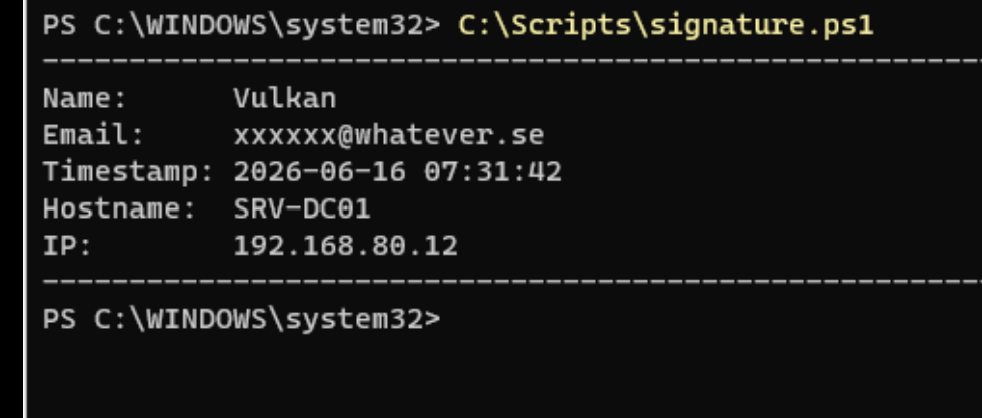

### Installing Active Directory Domain Services and DNS

I installed the following server roles on `srv-dc01`:

* Active Directory Domain Services
* DNS Server

Active Directory Domain Services, AD DS, is used to manage domain users, computers, groups, organizational units and authentication.

DNS Server is needed because Active Directory depends on DNS to locate domain controllers and domain services.

The roles were installed through Server Manager using the Add Roles and Features Wizard.

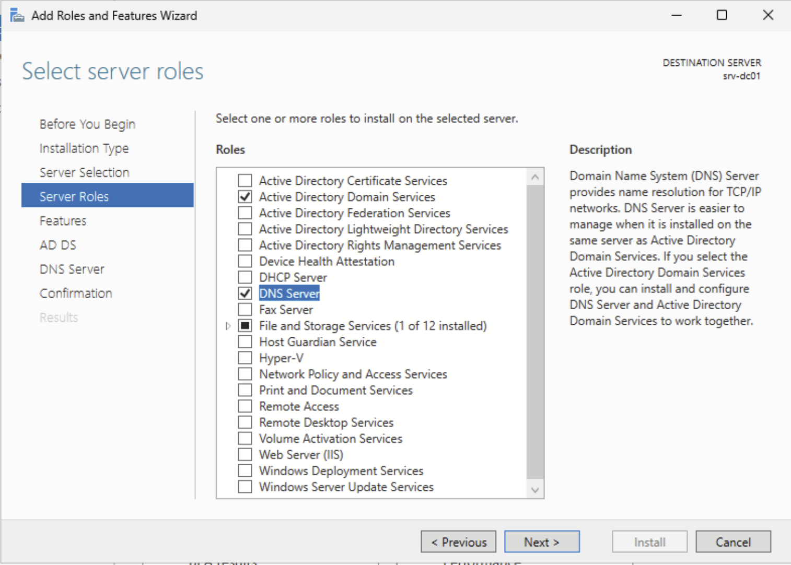

After the roles were installed, Server Manager showed that additional configuration was required. I then promoted the server to a domain controller.

### Domain controller promotion

I promoted `srv-dc01` to a domain controller and created a new Active Directory forest.

Root domain name:

`bjorklunda.local`

The server was configured as:

* Domain controller
* DNS server
* Global Catalog server

The prerequisites check passed successfully before installation.

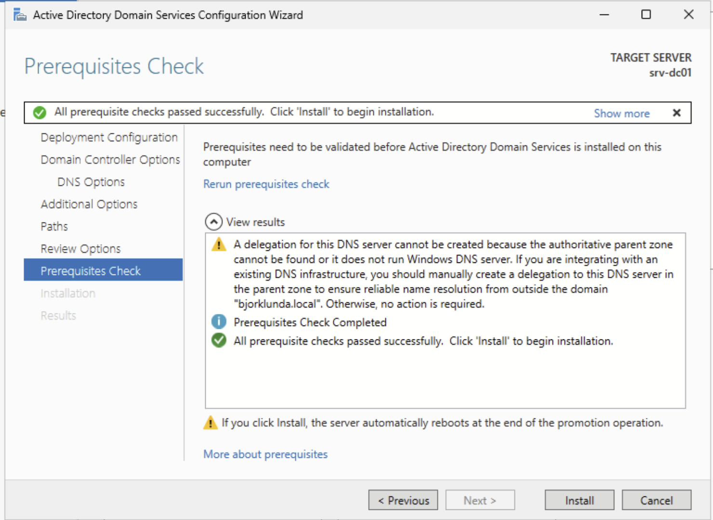

After the promotion, the server restarted. I logged in as the domain administrator account.

I verified the domain controller promotion with:

```powershell
hostname
whoami
ipconfig
```

The command `hostname` confirmed that the server name was `srv-dc01`.

The command `whoami` confirmed that I was logged in as:

`bjorklunda\administrator`

The command `ipconfig` confirmed that the server still had the IP address `192.168.80.12`.

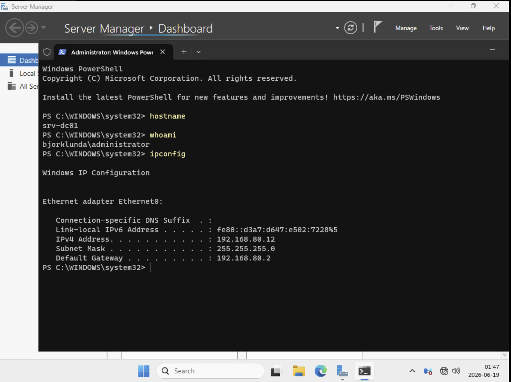

### Active Directory verification

I opened Active Directory Users and Computers from Server Manager.

This confirmed that the domain `bjorklunda.local` exists and that the server is functioning as a domain controller.

Active Directory Users and Computers is used to manage domain objects such as users, groups, computers and organizational units.

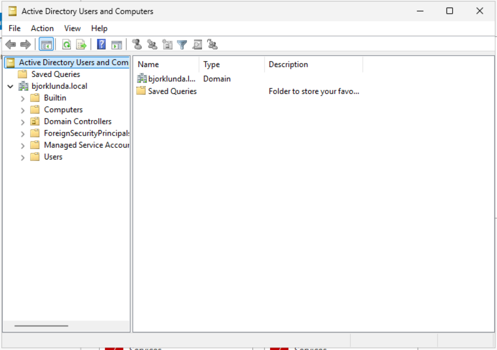

### Communication between Linux and Windows servers

I tested network communication between `srv-linux01` and `srv-dc01`.

From `srv-linux01`, I tested connectivity to `srv-dc01` with:

```bash
~/signature.sh
ping -c 4 192.168.80.12
```

The command `ping -c 4 192.168.80.12` sends four ICMP packets from the Linux server to the Windows domain controller.

The output showed `0% packet loss`, which means `srv-linux01` can reach `srv-dc01`.

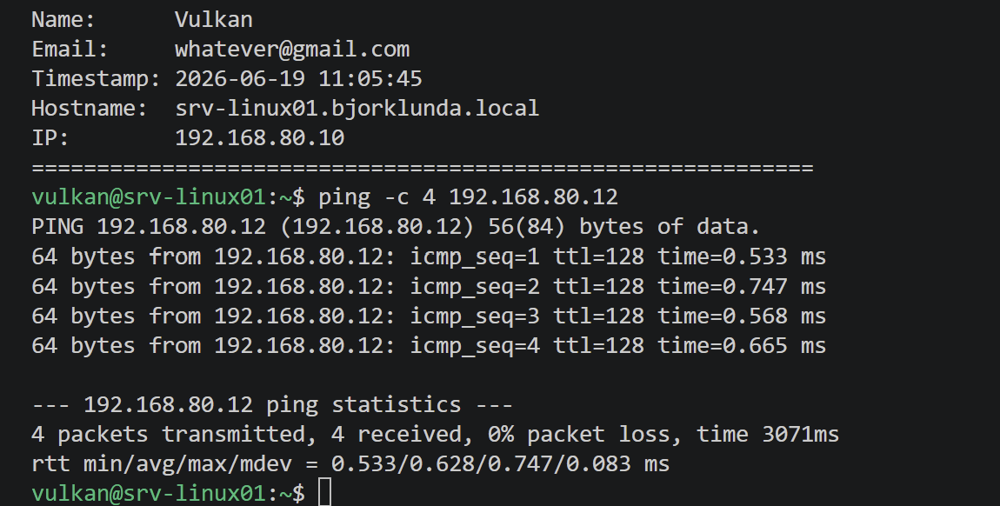

From `srv-dc01`, I tested connectivity to `srv-linux01` with:

```powershell
C:\Scripts\signature.ps1
ping 192.168.80.10
```

The command `ping 192.168.80.10` sends ICMP packets from the Windows domain controller to the Linux server.

The output showed successful replies, which means `srv-dc01` can reach `srv-linux01`.

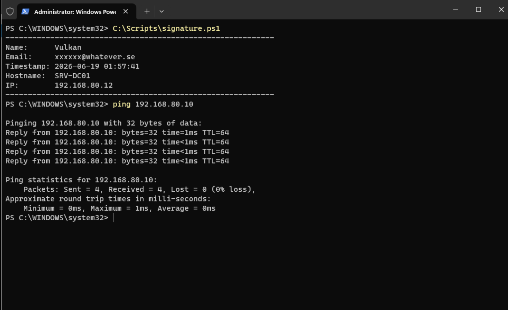

The successful ping tests confirm that both servers are on the same VMware NAT network and can communicate with each other.

### Organizational Unit structure

I created a custom Organizational Unit structure inside Active Directory Users and Computers.

The main OU is:

`Bjorklunda`

Inside `Bjorklunda`, I created these OUs:

* `Users`
* `Groups`
* `Computers`
* `Servers`
* `Departments`

Inside `Departments`, I created these department OUs:

* `IT`
* `HR`
* `Finance`
* `Education`

An Organizational Unit, OU, is used to organize Active Directory objects such as users, groups and computers. OUs also make it possible to apply Group Policy settings to specific parts of the domain instead of applying the same settings everywhere.

The OU structure was created in Active Directory Users and Computers.

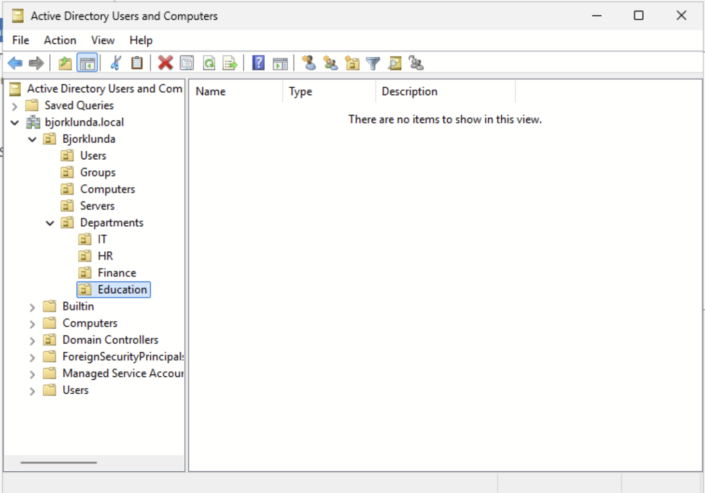

### Active Directory groups

I created four global security groups inside:

`Bjorklunda > Groups`

Groups created:

| Group                | Type                  | Purpose                   |
| -------------------- | --------------------- | ------------------------- |
| `GG_IT_Users`        | Global security group | Group for IT users        |
| `GG_HR_Users`        | Global security group | Group for HR users        |
| `GG_Finance_Users`   | Global security group | Group for Finance users   |
| `GG_Education_Users` | Global security group | Group for Education users |

A security group can be used to assign permissions to several users at once. This is better than giving permissions directly to individual users, because group-based permissions are easier to manage and audit.

The prefix `GG_` means Global Group. I used this naming style to make the group purpose clearer.

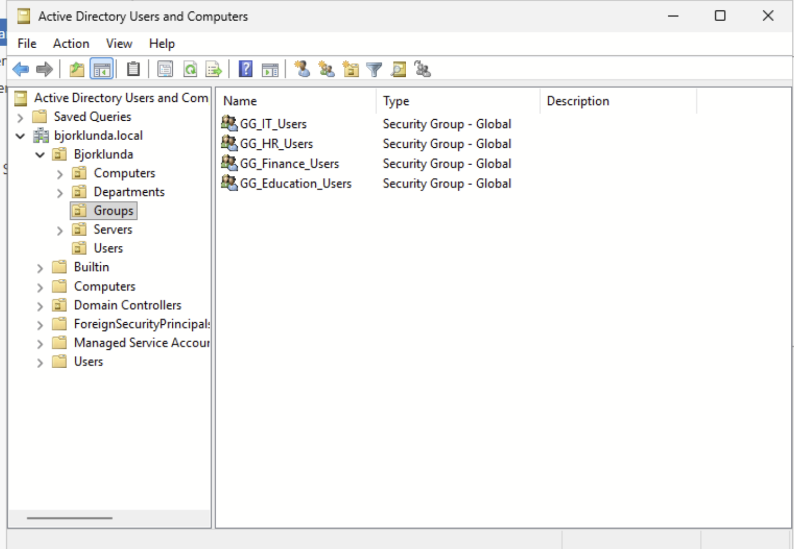

### Active Directory users

I created four test users inside:

`Bjorklunda > Users`

Users created:

| Display name       | User logon name    | Department |
| ------------------ | ------------------ | ---------- |
| `IT User01`        | `it.user01`        | IT         |
| `HR User01`        | `hr.user01`        | HR         |
| `Finance User01`   | `finance.user01`   | Finance    |
| `Education User01` | `education.user01` | Education  |

The users were created as test accounts for the lab environment. Each user represents one department.

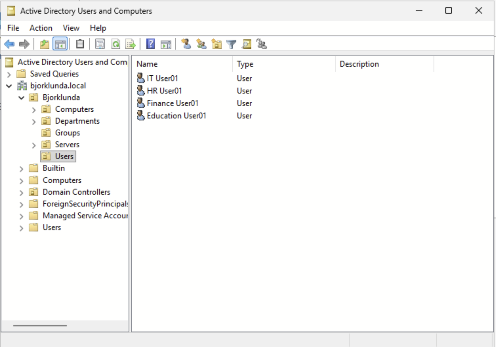

### Group membership

Each test user was added to the matching department group:

| User               | Group                |
| ------------------ | -------------------- |
| `it.user01`        | `GG_IT_Users`        |
| `hr.user01`        | `GG_HR_Users`        |
| `finance.user01`   | `GG_Finance_Users`   |
| `education.user01` | `GG_Education_Users` |

This means permissions can later be assigned to the groups instead of directly to the users. For example, if the IT department needs access to a folder, the folder permission can be assigned to `GG_IT_Users`.

### RHEL IdM server installation

I installed the second RHEL server for the lab environment:

`srv-idm01.bjorklunda.local`

This server will later be used as the RHEL Identity Management, IdM, server. RHEL IdM is used to centrally manage Linux users, groups, authentication and access control.

The VMware virtual machine was configured with the following settings:

| Setting          | Value                         |
| ---------------- | ----------------------------- |
| VM name          | `srv-idm01`                   |
| Operating system | Red Hat Enterprise Linux 10.1 |
| Memory           | 4 GB                          |
| Processors       | 2                             |
| Disk             | 60 GB                         |
| Network mode     | NAT                           |

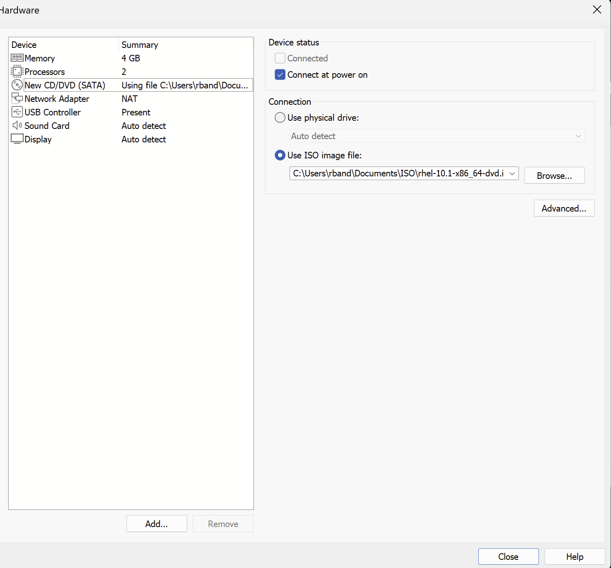

### srv-idm01 manual partitioning

During the installation, I used manual partitioning for `srv-idm01`.

The partition layout was based on the plan from Part 2, but I also added `/boot/efi` because the VM uses UEFI boot.

Final partition layout:

| Mount point |    Size | Filesystem           | Purpose                                                  |
| ----------- | ------: | -------------------- | -------------------------------------------------------- |
| `/boot/efi` | 600 MiB | EFI System Partition | Stores UEFI boot files                                   |
| `/boot`     |   1 GiB | XFS                  | Stores kernel and boot files                             |
| `/`         |  35 GiB | XFS                  | Stores the operating system, services, packages and logs |
| `/home`     |  15 GiB | XFS                  | Stores user home directories and administrator files     |
| `swap`      |   4 GiB | swap                 | Provides extra virtual memory if RAM becomes pressured   |

The root partition `/` was given more space than on `srv-linux01` because the IdM server will later run identity-related services and needs more room for packages, logs and service data.

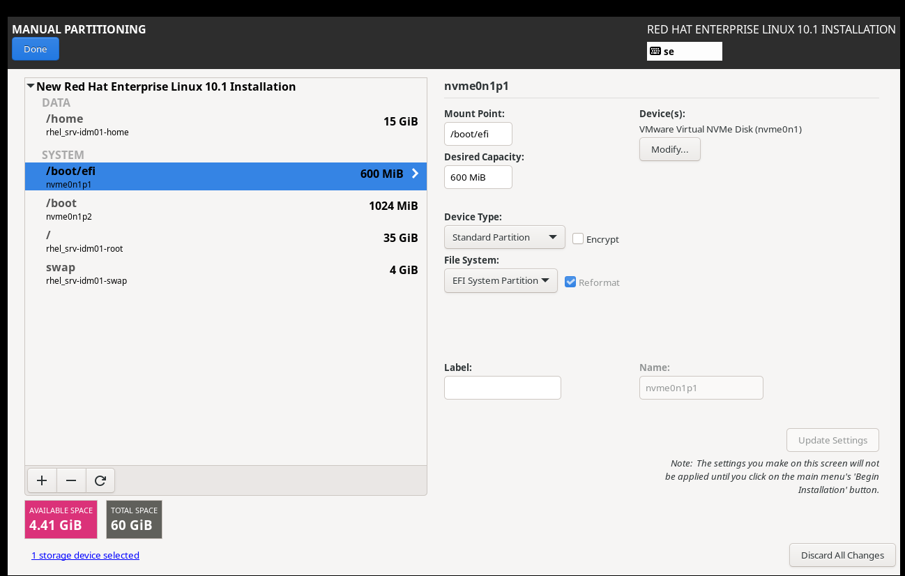

### srv-idm01 network and hostname configuration

I configured `srv-idm01` with a static IP address during installation.

Network configuration:

| Setting           | Value                        |
| ----------------- | ---------------------------- |
| Hostname          | `srv-idm01.bjorklunda.local` |
| IP address        | `192.168.80.11/24`           |
| Default gateway   | `192.168.80.2`               |
| DNS server        | `192.168.80.2`               |
| Network interface | `ens160`                     |

The server was placed on the same VMware NAT network as `srv-linux01` and `srv-dc01`.

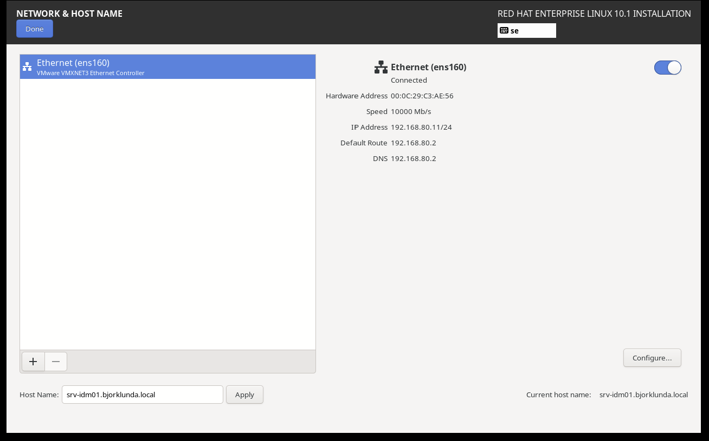

### srv-idm01 installation verification

After the installation, I logged in as the user:

`vulkan`

I verified the installation with these commands:

```bash
hostnamectl
ip addr show ens160
cat /etc/os-release
df -h
```

The command `hostnamectl` shows the configured hostname and system information.

The command `ip addr show ens160` shows the IP address configured on the network interface.

The command `cat /etc/os-release` shows the installed operating system version.

The command `df -h` shows mounted filesystems and disk usage in a human-readable format.

The verification confirmed that:

* `srv-idm01.bjorklunda.local` was configured as hostname
* `192.168.80.11/24` was configured as IP address
* Red Hat Enterprise Linux 10.1 was installed
* the manual partitions were mounted correctly

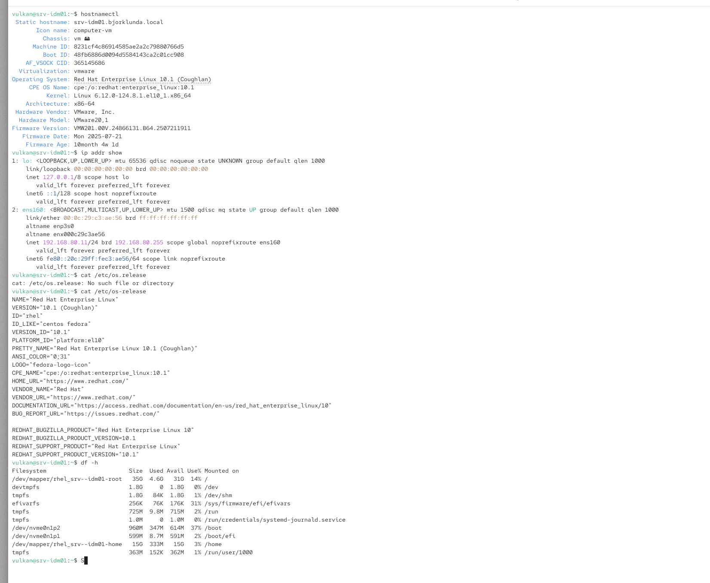

### srv-idm01 signature script

I copied the Linux signature script to `srv-idm01` and made it executable.

Command used from the Windows host:

```powershell
scp scripts/signature.sh vulkan@192.168.80.11:~/signature.sh
```

The command `scp` securely copies the signature script from my local repository to the home directory of the user `vulkan` on `srv-idm01`.

On `srv-idm01`, I made the script executable with:

```bash
chmod +x ~/signature.sh
```

The command `chmod +x` gives the script permission to run as a program.

I tested the script with:

```bash
~/signature.sh
```

The script printed the portfolio name, email placeholder, timestamp, hostname and IP address.

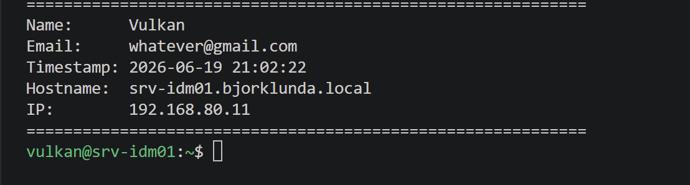

### Pre-IdM hostname, hosts file and time checks

Before installing RHEL Identity Management, I checked that the hostname, local hosts file and time synchronization were correct.

Commands used:

```bash
cat /etc/hosts
hostname -f
timedatectl
```

The command `cat /etc/hosts` shows local hostname mappings stored on the server. This was used to confirm that `srv-idm01.bjorklunda.local` was mapped to `192.168.80.11`.

The command `hostname -f` shows the full qualified domain name, FQDN, of the server. This was used to confirm that the server name was correctly set to `srv-idm01.bjorklunda.local`.

The command `timedatectl` shows the system time, time zone and time synchronization status. This is important because Kerberos authentication depends on correct time synchronization.

The checks confirmed that:

* `/etc/hosts` included `192.168.80.11 srv-idm01.bjorklunda.local srv-idm01`
* the full hostname was `srv-idm01.bjorklunda.local`
* the time zone was `Europe/Stockholm`
* system clock synchronization was enabled
* NTP service was active

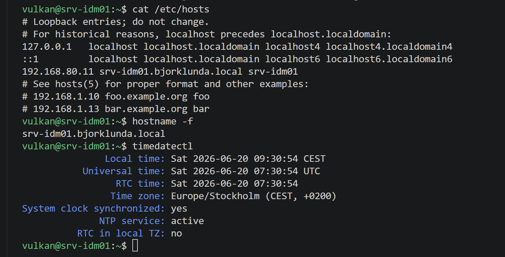

### Local RHEL ISO repository and IdM package installation

When I tried to install the IdM packages, the server could not use online Red Hat repositories because it was not registered with Red Hat Subscription Manager.

The problem message was that no repositories were available.

To solve this, I used the mounted RHEL installation ISO as a local package repository.

The ISO was mounted at:

```text
/run/media/vulkan/RHEL-10-1-BaseOS-x86_64
```

I created a local repository file:

```text
/etc/yum.repos.d/rhel-local.repo
```

The repository file made both BaseOS and AppStream packages available from the installation ISO.

The repository configuration used:

```ini
[BaseOS]
name=RHEL 10 Local BaseOS
baseurl=file:///run/media/vulkan/RHEL-10-1-BaseOS-x86_64/BaseOS
enabled=1
gpgcheck=0

[AppStream]
name=RHEL 10 Local AppStream
baseurl=file:///run/media/vulkan/RHEL-10-1-BaseOS-x86_64/AppStream
enabled=1
gpgcheck=0
```

Commands used:

```bash
sudo dnf clean all
sudo dnf repolist
sudo dnf install -y ipa-server ipa-server-dns
which ipa-server-install
```

The command `sudo dnf clean all` clears old repository metadata.

The command `sudo dnf repolist` shows enabled package repositories.

The command `sudo dnf install -y ipa-server ipa-server-dns` installs the RHEL Identity Management server packages and the integrated DNS packages.

The command `which ipa-server-install` confirms that the IdM installer command exists on the system.

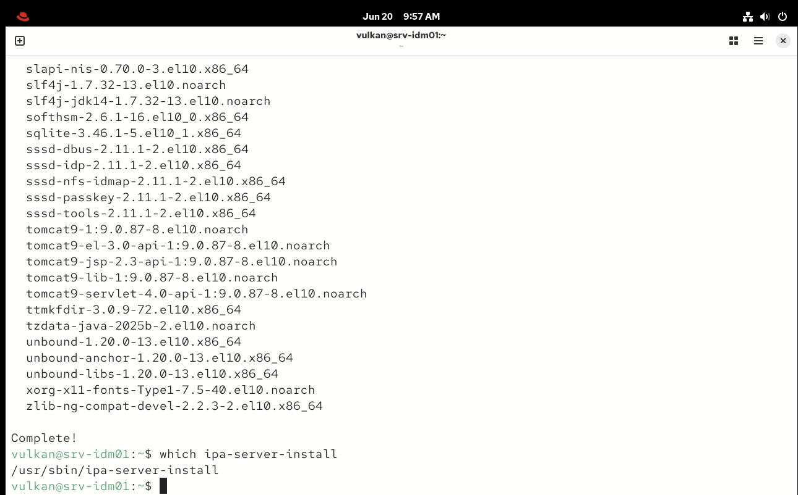

### RHEL Identity Management installation

I installed RHEL Identity Management on:

`srv-idm01.bjorklunda.local`

The installation command was:

```bash
sudo ipa-server-install --setup-dns
```

The command `ipa-server-install` installs and configures the RHEL Identity Management server.

The option `--setup-dns` enables integrated DNS on the IdM server. This is important because IdM depends on DNS for Kerberos, host records, service discovery and reliable authentication.

Installation values used:

| Setting        | Value                        |
| -------------- | ---------------------------- |
| Hostname       | `srv-idm01.bjorklunda.local` |
| IP address     | `192.168.80.11`              |
| Domain name    | `bjorklunda.local`           |
| Kerberos realm | `BJORKLUNDA.LOCAL`           |
| NetBIOS name   | `BJORKLUNDA`                 |
| Integrated DNS | Enabled                      |
| DNS forwarder  | `192.168.80.2`               |
| Reverse zone   | `80.168.192.in-addr.arpa`    |

The installer configured several important components:

* Directory Service
* Kerberos KDC
* Kerberos admin service
* BIND DNS
* Apache HTTP service for the IdM web interface
* Certificate services
* IPA client configuration

The installer completed successfully and showed:

```text
Setup complete
The ipa-server-install command was successful
```

**Screenshot note:** The IdM installation success screenshot should be added later if you save it as `screenshots/screenshot-30-srv-idm01-idm-install-success.png`.

### IdM service verification

I verified the IdM service status with:

```bash
sudo ipactl status
```

The command `ipactl status` checks the main IdM services.

The command had to be run with `sudo` because `ipactl` requires root permissions.

The output showed that the following IdM services were running:

* Directory Service
* krb5kdc
* kadmin
* named
* httpd
* ipa-custodia
* pki-tomcatd
* ipa-otpd
* ipa-dnskeysyncd

This confirms that the IdM services started correctly.

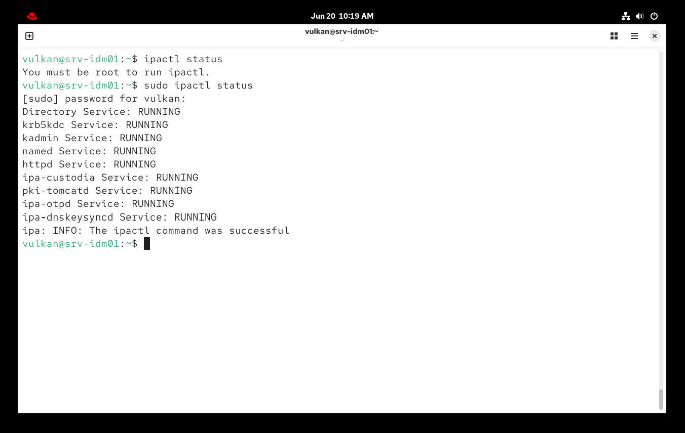

### Kerberos verification

I requested a Kerberos ticket for the IdM administrator account with:

```bash
kinit admin
```

The command `kinit admin` authenticates as the IdM admin user and requests a Kerberos ticket.

Kerberos tickets are used so authenticated users can run IdM commands without typing the password for every command.

I checked the active ticket with:

```bash
klist
```

The command `klist` shows the current Kerberos ticket cache.

The output showed:

```text
Default principal: admin@BJORKLUNDA.LOCAL
```

This confirms that Kerberos authentication works for the IdM admin account.

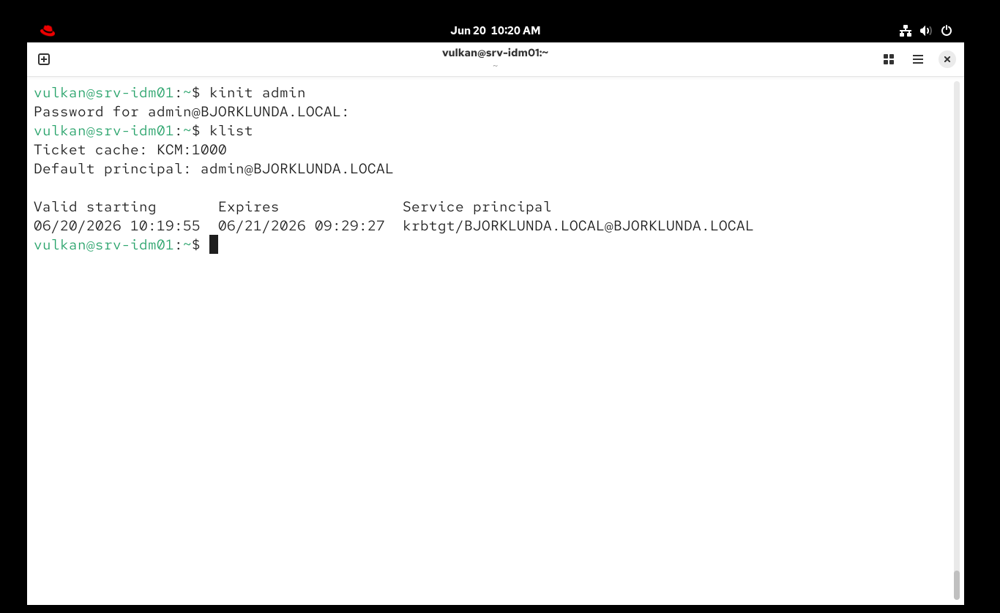

### IPA command verification

I verified that IPA commands worked with the Kerberos admin ticket.

Commands used:

```bash
ipa user-find
ipa group-find
ipa host-find
```

The command `ipa user-find` lists users stored in IdM.

The command `ipa group-find` lists groups stored in IdM.

The command `ipa host-find` lists hosts registered in IdM.

The results confirmed that:

* the built-in `admin` user exists
* default IdM groups exist, including `admins`, `editors`, `ipausers` and `trust admins`
* the host `srv-idm01.bjorklunda.local` is registered in IdM

This confirms that the IdM database and IPA command-line tools are working.

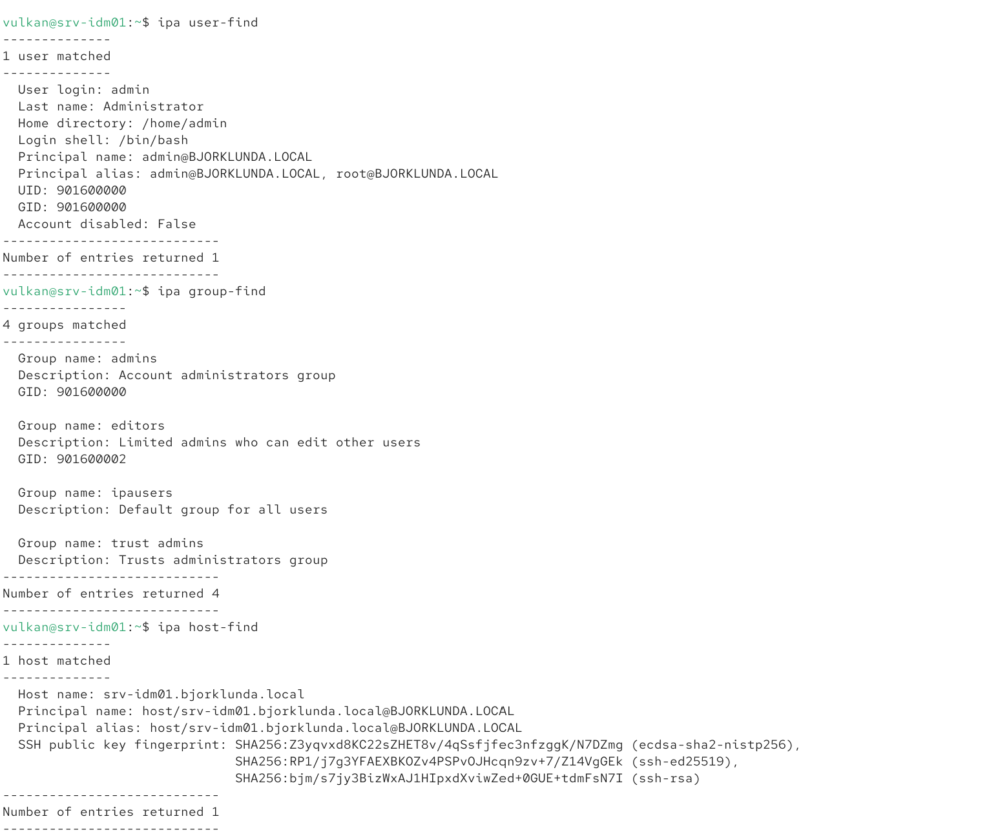

### IdM DNS verification

I verified forward and reverse DNS through the IdM DNS service.

Commands used:

```bash
dig srv-idm01.bjorklunda.local
dig -x 192.168.80.11
```

The command `dig srv-idm01.bjorklunda.local` checks forward DNS. It verifies that the hostname resolves to an IP address.

The command `dig -x 192.168.80.11` checks reverse DNS. It verifies that the IP address resolves back to a hostname.

The forward lookup returned:

```text
srv-idm01.bjorklunda.local. 1200 IN A 192.168.80.11
```

The reverse lookup returned:

```text
11.80.168.192.in-addr.arpa. 86400 IN PTR srv-idm01.bjorklunda.local.
```

The DNS server used was:

```text
127.0.0.1#53
```

This means the lookup was answered by the local DNS service running on `srv-idm01`.

The output also showed a warning that `.local` is reserved for multicast DNS. For this isolated lab environment, the DNS lookups still worked correctly.

**Screenshot note:** The DNS verification screenshot should be added later if you save it as `screenshots/screenshot-33-srv-idm01-dns-checks.png`.

### Firewall verification and IdM services

I checked the firewall with:

```bash
sudo firewall-cmd --list-all
```

The command `firewall-cmd --list-all` shows the active firewall zone, allowed services, open ports and network interfaces.

Before opening IdM services, the firewall only showed:

```text
cockpit dhcpv6-client ssh
```

This meant that basic administration services were allowed, but IdM-related services were not shown in the firewall configuration.

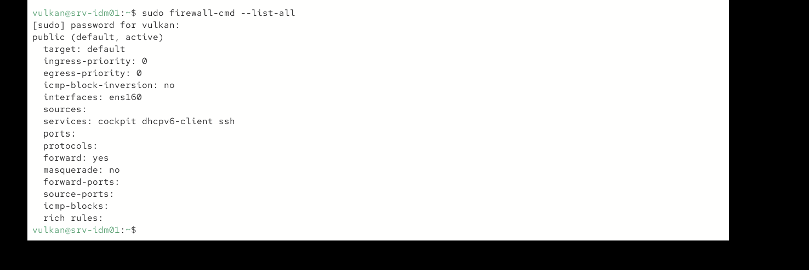

I added the required IdM-related firewall services with:

```bash
sudo firewall-cmd --permanent --add-service=freeipa-ldap
sudo firewall-cmd --permanent --add-service=freeipa-ldaps
sudo firewall-cmd --permanent --add-service=dns
sudo firewall-cmd --permanent --add-service=ntp
sudo firewall-cmd --reload
```

The option `--permanent` saves the firewall change so it remains after reboot.

The service `freeipa-ldap` allows core IdM and LDAP traffic.

The service `freeipa-ldaps` allows secure LDAP and related IdM traffic.

The service `dns` allows DNS traffic.

The service `ntp` allows time synchronization traffic.

The command `sudo firewall-cmd --reload` reloads the firewall so the permanent changes become active.

After reloading the firewall, I checked the firewall again:

```bash
sudo firewall-cmd --list-all
```

The services line showed:

```text
cockpit dhcpv6-client dns freeipa-ldap freeipa-ldaps ntp ssh
```

This confirms that the firewall allows the required IdM, DNS and time synchronization services.

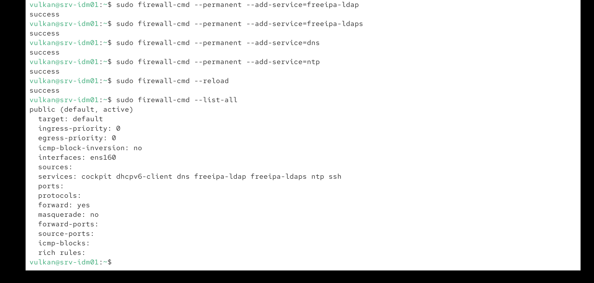

### Final IdM verification

I performed a final verification with:

```bash
hostnamectl
ip addr show ens160
sudo ipactl status
sudo firewall-cmd --list-all
```

The command `hostnamectl` confirms the server hostname and operating system information.

The command `ip addr show ens160` confirms the IP address on the network interface.

The command `sudo ipactl status` confirms that IdM services are running.

The command `sudo firewall-cmd --list-all` confirms that the firewall has the required services open.

The final verification confirmed:

* hostname: `srv-idm01.bjorklunda.local`
* operating system: Red Hat Enterprise Linux 10.1
* IP address: `192.168.80.11/24`
* interface: `ens160`
* IdM services: running
* firewall services: `cockpit dhcpv6-client dns freeipa-ldap freeipa-ldaps ntp ssh`

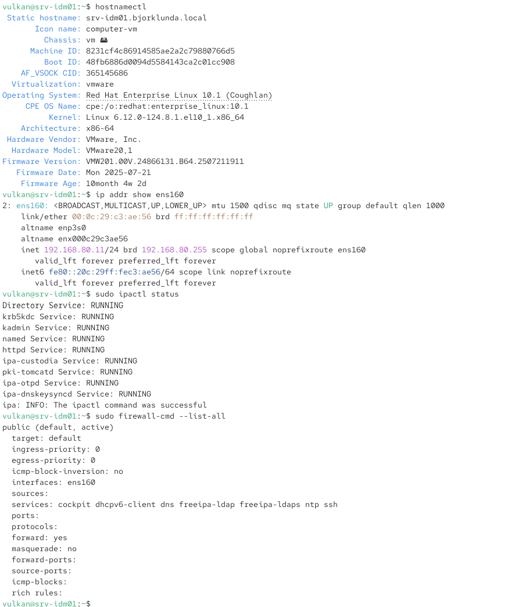

### srv-idm01 status

At this point, `srv-idm01` is installed, configured and verified as a RHEL Identity Management server.

The server now provides Linux identity management services for the lab environment, including Kerberos, LDAP, DNS, certificates and centralized Linux authentication features.

The next step will be to create IdM users and groups with a Bash script, verify them with IPA commands, and later connect `srv-linux01` to the IdM server.


## Part 5 — Account management with scripts

In this part I started preparing account management scripts for the Björklunda Admin Lab.

The goal of this part is to show how user and group management can be automated instead of creating every account manually.

In a real administration environment, scripting is useful because it makes account creation faster, more consistent and easier to repeat. It also reduces the risk of small manual mistakes, such as placing a user in the wrong OU or forgetting a group membership.

### PowerShell script for Active Directory users and groups

I created a PowerShell script for Active Directory account management.

Script file:

`scripts/create_ad_users_groups.ps1`

The purpose of this script is to create and verify the Active Directory OU structure, groups, users and group memberships for the lab environment.

The script is designed to work with the domain:

`bjorklunda.local`

It uses the Active Directory PowerShell module:

```powershell
Import-Module ActiveDirectory
```

The command `Import-Module ActiveDirectory` loads the PowerShell commands used to manage Active Directory, such as commands for users, groups and organizational units.

The script defines these important AD paths:

```powershell
$DomainDN = "DC=bjorklunda,DC=local"
$MainOU = "OU=Bjorklunda,$DomainDN"
$UsersOU = "OU=Users,$MainOU"
$GroupsOU = "OU=Groups,$MainOU"
$DepartmentsOU = "OU=Departments,$MainOU"
```

These variables make the script easier to read and maintain. Instead of writing the full OU path many times, the script stores the paths in variables.

### OU creation logic

The script contains a function called:

```powershell
Ensure-OU
```

The purpose of this function is to create an OU only if it does not already exist.

This is important because a script should be safe to run more than once. If the OU already exists, the script should not create a duplicate or stop with unnecessary errors.

The script creates the main OU structure:

* `Bjorklunda`
* `Users`
* `Groups`
* `Computers`
* `Servers`
* `Departments`
* `IT`
* `HR`
* `Finance`
* `Education`

### Group creation logic

The script contains a function called:

```powershell
Ensure-Group
```

The purpose of this function is to create a group only if it does not already exist.

The script is prepared to create these global security groups:

| Group                | Purpose                   |
| -------------------- | ------------------------- |
| `GG_IT_Users`        | Group for IT users        |
| `GG_HR_Users`        | Group for HR users        |
| `GG_Finance_Users`   | Group for Finance users   |
| `GG_Education_Users` | Group for Education users |

The groups are global security groups, which means they can be used for assigning permissions to users in this domain.

### User creation logic

The script contains a function called:

```powershell
Ensure-User
```

The purpose of this function is to create a user only if it does not already exist.

The script is prepared to create these test users:

| User               | Logon name         | Group                |
| ------------------ | ------------------ | -------------------- |
| `IT User01`        | `it.user01`        | `GG_IT_Users`        |
| `HR User01`        | `hr.user01`        | `GG_HR_Users`        |
| `Finance User01`   | `finance.user01`   | `GG_Finance_Users`   |
| `Education User01` | `education.user01` | `GG_Education_Users` |

The script uses a temporary lab password and sets the accounts to require a password change at next logon.

This is useful because the administrator can create accounts with a temporary password, but the user must choose their own password when they first log in.

### Group membership logic

The script uses:

```powershell
Add-ADGroupMember
```

The command `Add-ADGroupMember` adds users to Active Directory groups.

This means permissions can later be assigned to the groups instead of directly to individual users.

For example, if the IT department needs access to an IT folder, the permission can be assigned to `GG_IT_Users`. Any IT user who is a member of that group will then receive the correct access.

### Verification script

I also created a verification script.

Script file:

`scripts/verify_ad_users_groups.ps1`

The purpose of this script is to verify which users and groups exist in the Björklunda OUs and to show group membership.

The script checks:

* users inside `Bjorklunda > Users`
* groups inside `Bjorklunda > Groups`
* members of each department group

This makes it easier to prove that the account structure exists and that users are placed in the correct groups.

### Script screenshot

I saved a screenshot showing the Part 5 scripts in VS Code.

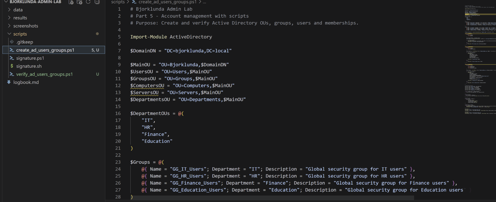

### Notes about the lab workflow

The AD users and groups were first created manually in Active Directory Users and Computers because VMware clipboard paste caused formatting problems when trying to paste longer PowerShell commands into the Windows Server VM.

After that, I created scripts in the repository to document how the same structure can be automated.

This is useful for the portfolio because the scripts show the intended automation logic even if the first setup was done manually.

### Bash script for IdM users and groups

I also created Bash scripts for account management in RHEL Identity Management.

Script files:

* `scripts/create_idm_users_groups.sh`
* `scripts/verify_idm_users_groups.sh`

The purpose of these scripts is to show how Linux user and group management can be automated in IdM instead of creating every account manually.

The create script was copied from the Windows host to `srv-idm01` with `scp`.

Commands used from Windows PowerShell:

```powershell
scp scripts/create_idm_users_groups.sh vulkan@192.168.80.11:~/create_idm_users_groups.sh
scp scripts/verify_idm_users_groups.sh vulkan@192.168.80.11:~/verify_idm_users_groups.sh
```

The command `scp` securely copies files from the Windows host to the Linux IdM server over SSH.

After copying the scripts, I connected to `srv-idm01` using SSH:

```powershell
ssh vulkan@192.168.80.11
```

The command `ssh` opens a secure remote terminal session to the Linux server.

On `srv-idm01`, I made the scripts executable:

```bash
chmod +x ~/create_idm_users_groups.sh ~/verify_idm_users_groups.sh
```

The command `chmod +x` gives the scripts permission to run as programs.

Before running the IdM commands, I requested a Kerberos ticket:

```bash
kinit admin
```

The command `kinit admin` authenticates as the IdM administrator and creates a Kerberos ticket. The `ipa` commands need this ticket before they can create or manage IdM users and groups.

### IdM create script

The create script was run with:

```bash
~/create_idm_users_groups.sh
```

The script checks that a Kerberos ticket exists, creates IdM groups, creates IdM users and adds the users to the correct groups.

The final working IdM groups are:

| Group name | Purpose |
| ---------- | ------- |
| `linuxitusers` | Linux group for IT users |
| `linuxhrusers` | Linux group for HR users |
| `linuxfinanceusers` | Linux group for Finance users |
| `linuxeducationusers` | Linux group for Education users |

The final working IdM users are:

| User login | Group |
| ---------- | ----- |
| `linuxit01` | `linuxitusers` |
| `linuxhr01` | `linuxhrusers` |
| `linuxfinance01` | `linuxfinanceusers` |
| `linuxeducation01` | `linuxeducationusers` |

The script uses `ipa group-add` to create groups, `ipa user-add` to create users, and `ipa group-add-member` to connect users to groups.

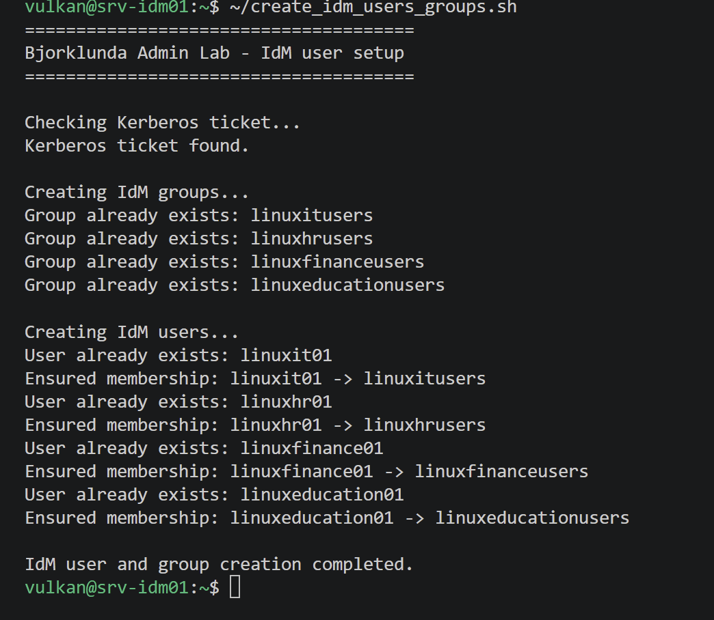

### IdM verification script

The verification script was run with:

```bash
~/verify_idm_users_groups.sh
```

The script checks that a Kerberos ticket exists and then verifies users, groups and group memberships with IPA commands.

The script uses:

```bash
ipa user-find linux
ipa group-find linux
ipa group-show groupname
```

The command `ipa user-find linux` searches for the Linux IdM users.

The command `ipa group-find linux` searches for the Linux IdM groups.

The command `ipa group-show groupname` shows details about a group, including member users.

The verification confirmed that four users and four groups were created, and that each user was a member of the correct group.

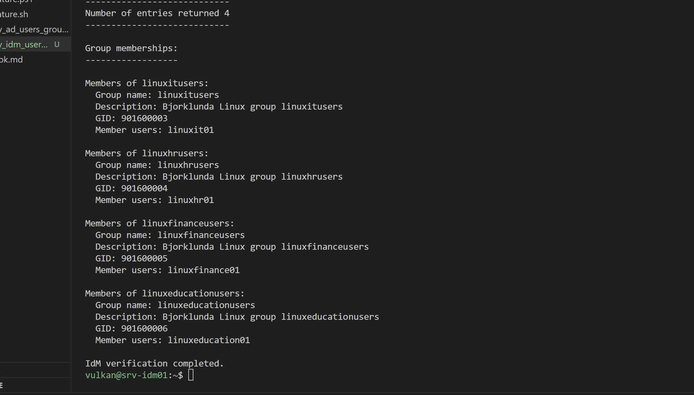

### IdM scripting troubleshooting

There were three main issues during this part.

The first issue was that Linux commands were accidentally run inside Windows PowerShell. Commands such as `chmod`, `kinit` and `~/create_idm_users_groups.sh` must be run on the Linux server, not on Windows. The correct workflow is to use `scp` from Windows to copy the scripts, then use `ssh` to connect to `srv-idm01`, and then run the Linux commands inside the SSH session.

The second issue was that earlier group names with symbols were rejected by IdM. To solve this, I changed the group and user names to simple lowercase alphanumeric names.

The third issue was that the Bash variable name `GROUPS` conflicted with Bash's built-in `GROUPS` variable. Bash uses `GROUPS` to store the current user's Linux group IDs. This caused the script to try to check group IDs such as `1000` and `10` instead of the intended IdM groups. I solved this by renaming the variable to `IDM_GROUPS`.

This made the script work correctly.


### Part 5 status

The Active Directory script preparation is completed.

The IdM Bash script part is also completed. The scripts create IdM users, create IdM groups, add the users to the correct groups and verify the result with IPA commands.

Part 5 now shows both Windows account automation with PowerShell and Linux IdM account automation with Bash.


## Part 6 — Shared folders and permissions

In this part I created shared department folders on the Windows Server domain controller `srv-dc01`.

The goal of this part was to create central folders for different departments and control access with Active Directory security groups.

In a real environment, shared folders are useful because users can store department files in a central location instead of keeping everything on individual computers. Permissions should be assigned to groups instead of individual users, because group-based permissions are easier to manage, review and change later.

### Department folder structure

I created a main folder on `srv-dc01`:

`C:\Shares`

Inside this folder, I created one folder for each department:

| Folder | Purpose |
| ------ | ------- |
| `C:\Shares\IT` | Shared folder for IT department files |
| `C:\Shares\HR` | Shared folder for HR department files |
| `C:\Shares\Finance` | Shared folder for Finance department files |
| `C:\Shares\Education` | Shared folder for Education department files |

I verified the folder structure with:

```powershell
Get-ChildItem C:\Shares
```

The command `Get-ChildItem C:\Shares` lists the folders inside `C:\Shares`.

The output showed the four department folders:

* `Education`
* `Finance`
* `HR`
* `IT`

This confirmed that the local folder structure was created correctly.

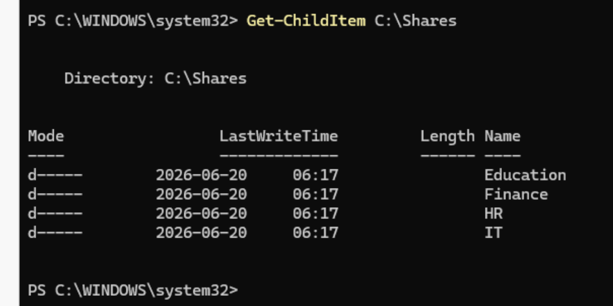

### SMB shares

After creating the folders, I shared them through Server Manager under:

`File and Storage Services > Shares`

I used the New Share Wizard and selected:

`SMB Share - Quick`

SMB, Server Message Block, is the Windows protocol used for network file sharing. An SMB share makes a local folder available through a network path such as `\\srv-dc01\IT`.

I created the following SMB shares:

| Share name | Local path | Network path |
| ---------- | ---------- | ------------ |
| `IT` | `C:\Shares\IT` | `\\srv-dc01\IT` |
| `HR` | `C:\Shares\HR` | `\\srv-dc01\HR` |
| `Finance` | `C:\Shares\Finance` | `\\srv-dc01\Finance` |
| `Education` | `C:\Shares\Education` | `\\srv-dc01\Education` |

Server Manager showed six shares in total. The two default domain controller shares were:

* `NETLOGON`
* `SYSVOL`

The four new department shares were:

* `IT`
* `HR`
* `Finance`
* `Education`

I did not change `NETLOGON` or `SYSVOL` because those shares are used by Active Directory.

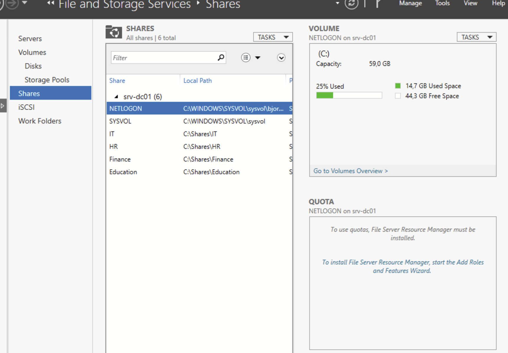

### SMB share verification

I verified the SMB shares in PowerShell with:

```powershell
Get-SmbShare
```

The command `Get-SmbShare` lists SMB shares on the server.

The output showed the new department shares:

* `Education` with path `C:\Shares\Education`
* `Finance` with path `C:\Shares\Finance`
* `HR` with path `C:\Shares\HR`
* `IT` with path `C:\Shares\IT`

It also showed the default administrative and domain shares, such as `ADMIN$`, `C$`, `IPC$`, `NETLOGON` and `SYSVOL`.

This confirmed that the department folders were shared over the network.

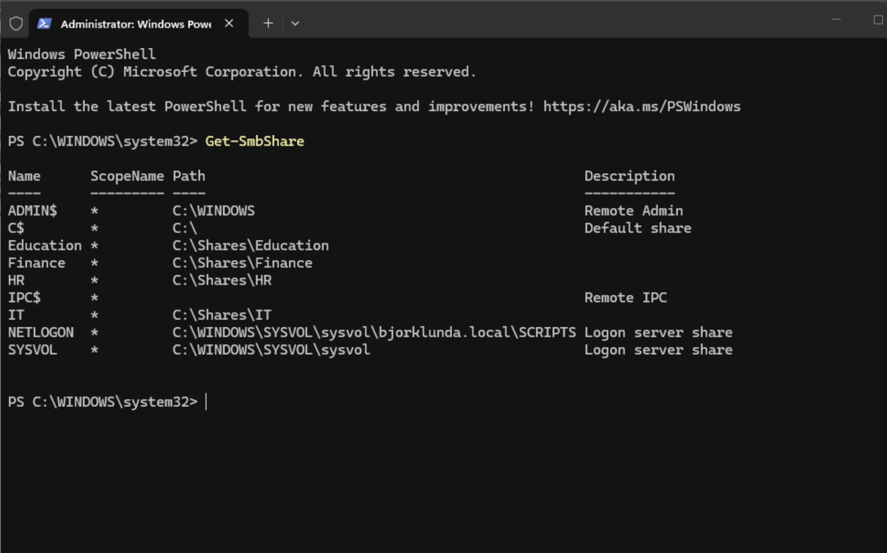

### SMB share access check

I checked share-level access with:

```powershell
Get-SmbShareAccess IT
Get-SmbShareAccess HR
Get-SmbShareAccess Finance
Get-SmbShareAccess Education
```

The command `Get-SmbShareAccess` shows share-level permissions for an SMB share.

Share-level permissions control access at the network share layer. They are different from NTFS permissions, which control access on the folder itself.

This check was used to document the share access configuration for the four department shares.

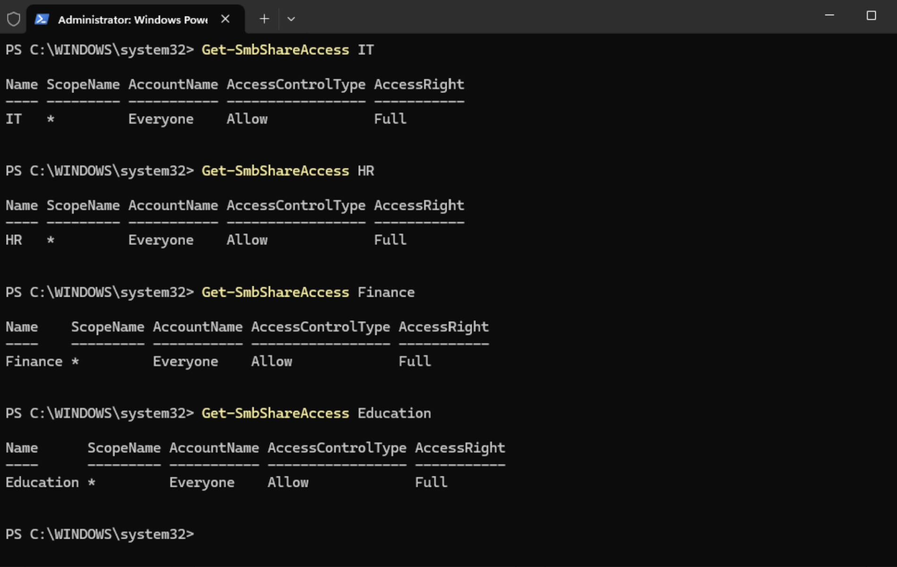

### NTFS permissions

After creating the SMB shares, I configured NTFS permissions on the folders.

Windows file access has two permission layers:

| Permission type | Meaning |
| --------------- | ------- |
| Share permission | Controls access through the network share |
| NTFS permission | Controls access to the folder on the disk |

A user must have access through both layers. The most restrictive permission applies.

I assigned Modify permission to the matching department groups:

| Folder | Active Directory group | Permission |
| ------ | ---------------------- | ---------- |
| `C:\Shares\IT` | `BJORKLUNDA\GG_IT_Users` | Modify |
| `C:\Shares\HR` | `BJORKLUNDA\GG_HR_Users` | Modify |
| `C:\Shares\Finance` | `BJORKLUNDA\GG_Finance_Users` | Modify |
| `C:\Shares\Education` | `BJORKLUNDA\GG_Education_Users` | Modify |

The Modify permission allows users to read, create, edit and delete normal files in their department folder.

I kept administrator and system permissions so that administrators can still manage the folders.

I verified NTFS permissions with:

```powershell
icacls C:\Shares\IT
icacls C:\Shares\HR
icacls C:\Shares\Finance
icacls C:\Shares\Education
```

The command `icacls` shows NTFS permissions for files and folders.

The output showed the matching department groups with:

```text
(OI)(CI)(M)
```

This means:

| Code | Meaning |
| ---- | ------- |
| `OI` | Object inherit, files inside the folder inherit the permission |
| `CI` | Container inherit, subfolders inherit the permission |
| `M` | Modify permission |

This confirmed that the department groups had Modify permissions on their matching folders.

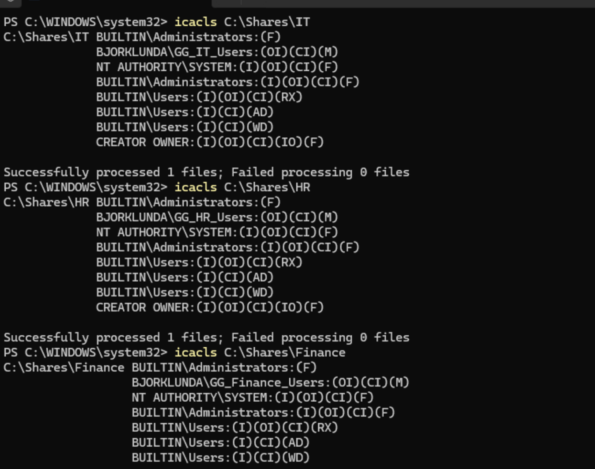

### Network path verification

I tested the network path by opening:

`\\srv-dc01`

The network view showed the shared folders:

* `Education`
* `Finance`
* `HR`
* `IT`
* `NETLOGON`
* `SYSVOL`

This confirmed that the department shares were reachable through the server name and visible as network shares.

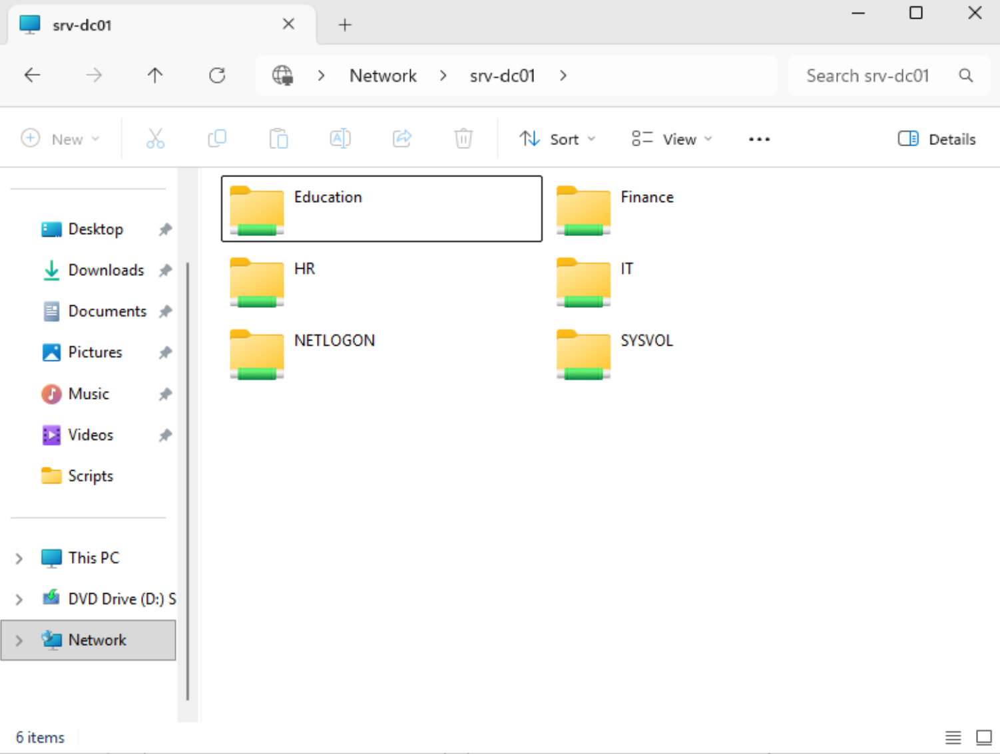

### Part 6 status

The shared folders and permissions part is completed.

The final result is:

* four local department folders were created under `C:\Shares`
* four SMB shares were created for the departments
* SMB shares were verified with `Get-SmbShare`
* share access was checked with `Get-SmbShareAccess`
* NTFS permissions were applied to the matching Active Directory groups
* NTFS permissions were verified with `icacls`
* the network path `\\srv-dc01` showed the department shares

This part demonstrates basic Windows Server file sharing, SMB shares, NTFS permissions and group-based access control.


## Part 7 — Printing system

In this part I configured and documented a basic printing system on the Windows Server domain controller `srv-dc01`.

The goal of this part was to show how a Windows Server can be used as a central print server. In a real organization, a print server makes printer management easier because printers, printer queues, printer drivers, sharing and permissions can be managed from one central place instead of being configured separately on every client computer.

### Print server role

I installed the Windows Server role:

`Print and Document Services`

The selected role service was:

`Print Server`

The Print Server role allows Windows Server to manage printers, printer queues, printer drivers and shared printers.

This role was installed through Server Manager by using:

`Manage > Add Roles and Features`

Server Manager is the main Windows Server administration tool. It is used to install roles and features, check server status and open administrative consoles.

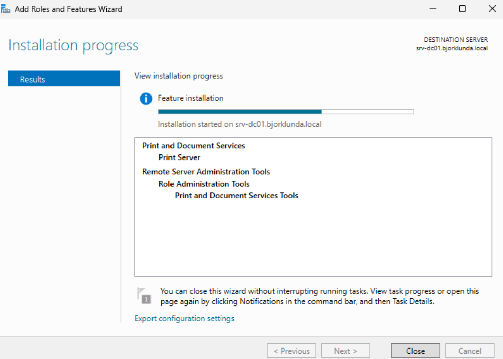

After the installation completed, the Print Server role was ready to use on `srv-dc01`.

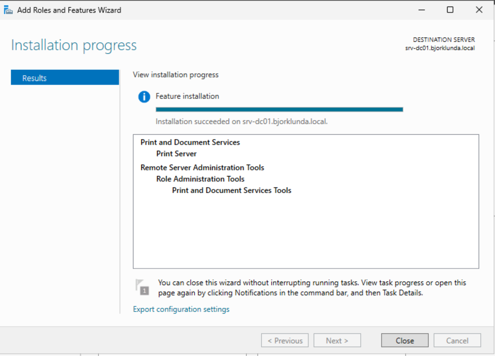

### Print Management

After installing the role, I opened Print Management from Server Manager:

`Tools > Print Management`

Print Management is a Windows Server administration console used to manage print servers, printers, printer drivers, ports, forms and deployed printers.

I used Print Management to create and share a lab test printer.

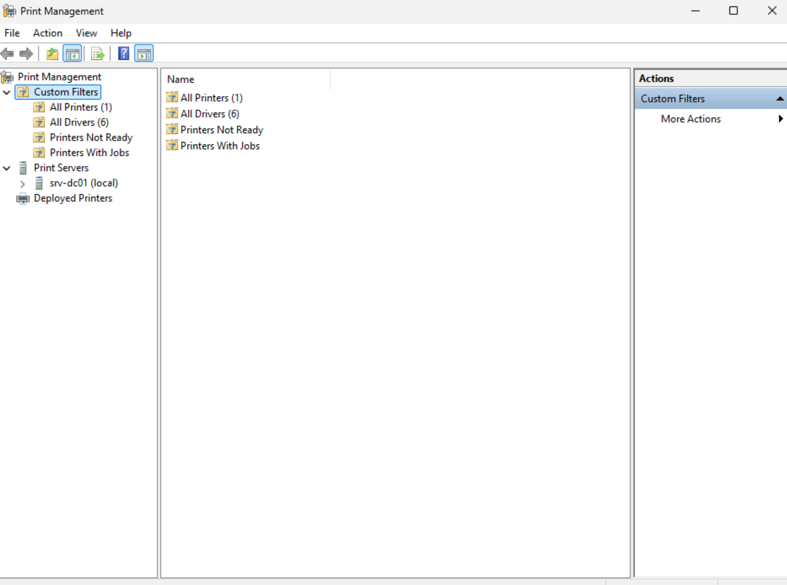

### First printer attempt

The first test printer was created with the Microsoft Print to PDF driver.

Printer name:

`Bjorklunda-Test-Printer`

The printer was visible in Print Management and PowerShell, but it was not shared.

PowerShell command used:

```powershell
Get-Printer
```

The command `Get-Printer` lists printers installed on the Windows Server.

The output showed that `Bjorklunda-Test-Printer` existed, but the `Shared` column showed:

```text
False
```

I tried to enable sharing with:

```powershell
Set-Printer -Name "Bjorklunda-Test-Printer" -Shared $true -ShareName "Bjorklunda-Test-Printer"
```

The command `Set-Printer` changes settings on an existing printer. In this case, it was used to try to enable printer sharing and set the share name.

This failed with the error:

```text
HRESULT 0x80070bce
```

I then checked the printer properties in Print Management. The Sharing tab showed:

```text
Sharing is not supported for this type of printer.
```

This confirmed that the problem was not caused by permissions or by the PowerShell syntax. The Microsoft Print to PDF printer type did not support sharing in this setup.

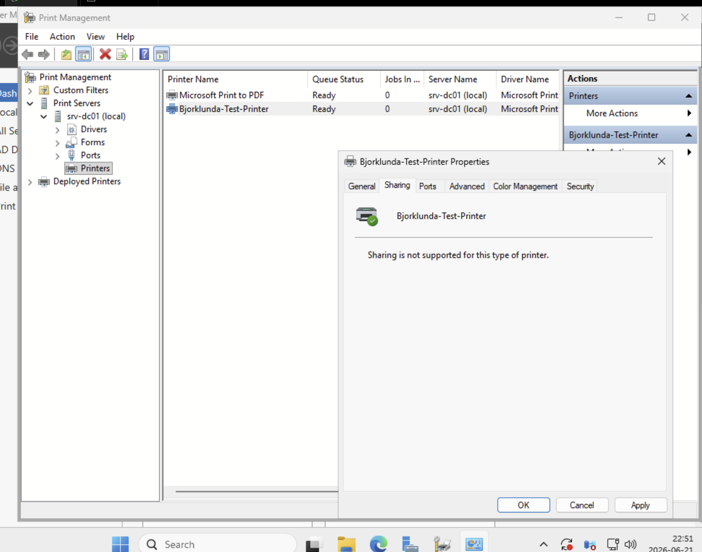

### Troubleshooting solution

To solve the problem, I deleted the first test printer and created a new dummy printer with a simpler driver and local port.

I created a folder for dummy print output:

```powershell
New-Item -ItemType Directory -Path C:\PrintTest
```

The command `New-Item` creates a new item in PowerShell.

The option `-ItemType Directory` tells PowerShell to create a folder.

The option `-Path C:\PrintTest` tells PowerShell where the folder should be created.

This folder was used as a local destination for the test printer output.

### Final test printer

I created a new printer in Print Management by using the Network Printer Installation Wizard.

The printer was created with these settings:

| Setting | Value |
| ------- | ----- |
| Printer name | `Bjorklunda-Test-Printer` |
| Share name | `Bjorklunda-Test-Printer` |
| Driver | `Generic / Text Only` |
| Port type | Local Port |
| Port name | `C:\PrintTest\Bjorklunda-Test-Printer.prn` |
| Location | `srv-dc01` |
| Comment | Lab test printer for Bjorklunda Admin Lab Part 7 |

The `Generic / Text Only` driver was used because it is a simple built-in Windows printer driver. It does not require a specific physical printer model and is suitable for a lab test printer.

The Local Port sends the print output to a file path instead of a physical printer. This made it possible to document a shared printer without needing real printer hardware.

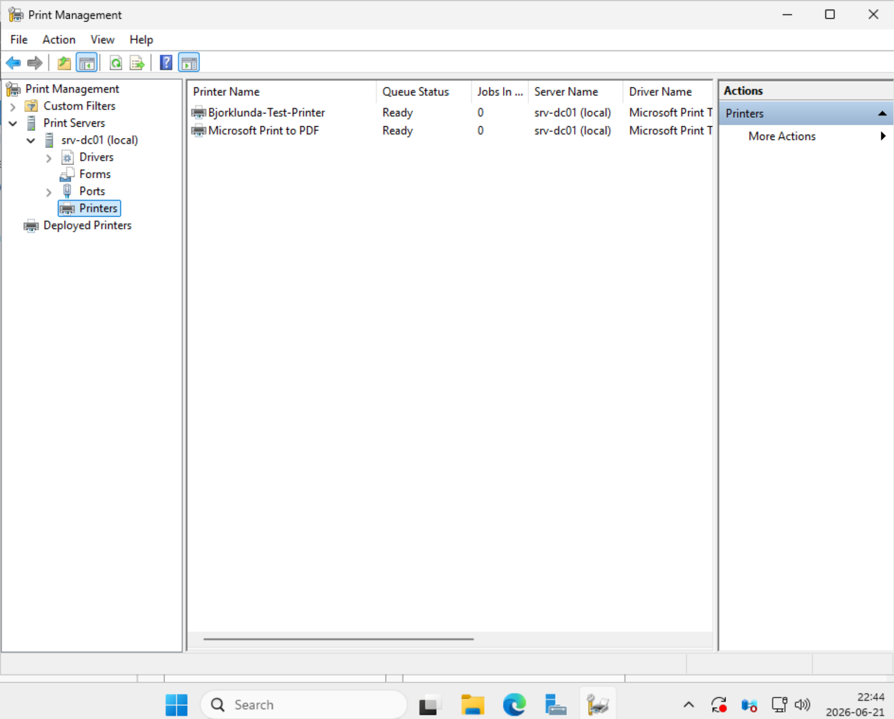

### Printer sharing

The printer was shared with the share name:

`Bjorklunda-Test-Printer`

This means the printer can be accessed through the network path:

```text
\\srv-dc01\Bjorklunda-Test-Printer
```

The printer name and the share name were kept the same to make the setup easier to understand and easier to document.

### PowerShell verification

I verified the printer with PowerShell:

```powershell
Get-Printer | Where-Object {$_.Name -like "*Bjorklunda*"}
```

The command `Get-Printer` lists printers installed on the server.

The pipe symbol `|` sends the printer list to the next command.

The command `Where-Object {$_.Name -like "*Bjorklunda*"}` filters the result so only printers with `Bjorklunda` in the name are shown.

The verification showed that `Bjorklunda-Test-Printer` existed and was shared.

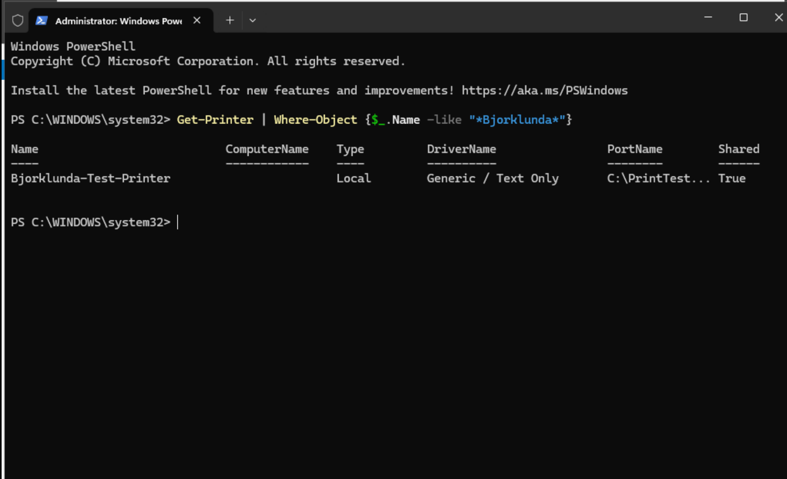

### Network path verification

I also verified the shared printer through File Explorer by opening:

```text
\\srv-dc01
```

This network path shows shared resources published by `srv-dc01`.

The shared printer was visible together with the existing shared folders and domain shares.

This confirmed that the printer was published over the network.

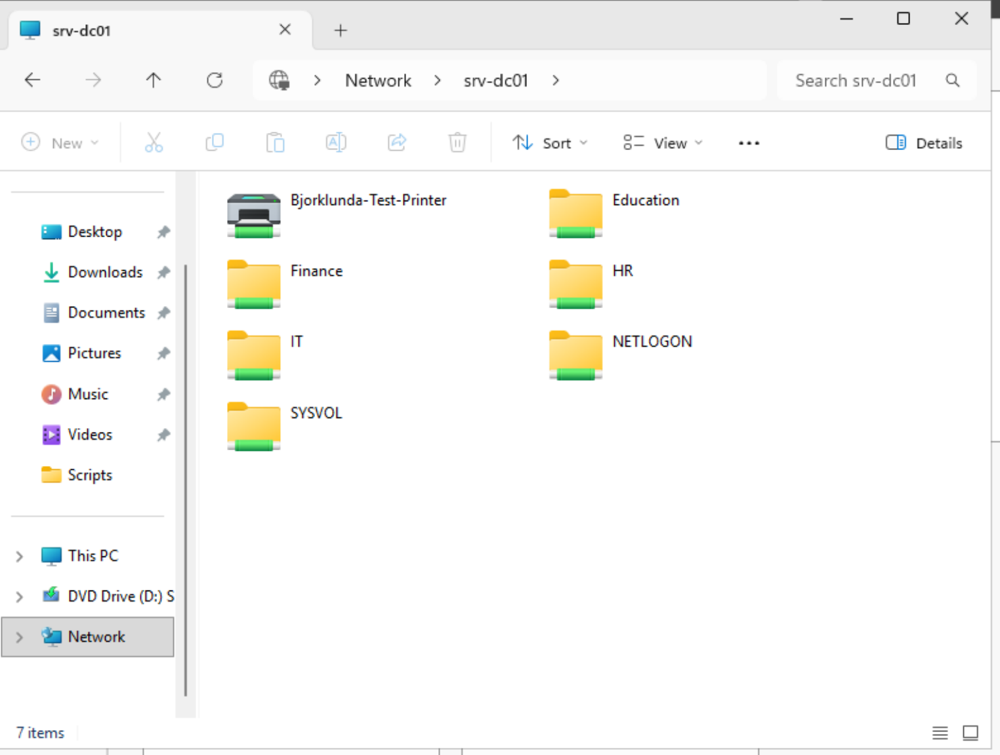

### Printer permissions

I checked the printer security settings in Print Management.

The Security tab is used to control who can print, manage the printer and manage documents in the print queue.

This is important in a real environment because printer access can be controlled with users and groups, in a similar way to folder permissions.


### Part 7 screenshots

| Screenshot | Description |
| ---------- | ----------- |
| `screenshot-48-srv-dc01-print-server-role-selected.png` | Print Server role selected in Server Manager |
| `screenshot-49-srv-dc01-print-server-role-installed.png` | Print Server role installation completed |
| `screenshot-50-srv-dc01-print-management-open.png` | Print Management console opened |
| `screenshot-51-srv-dc01-test-printer-created.png` | Test printer created in Print Management |
| `screenshot-52a-srv-dc01-print-to-pdf-sharing-not-supported.png` | Microsoft Print to PDF sharing limitation documented |
| `screenshot-52-srv-dc01-printer-powershell-verification.png` | Printer verified with PowerShell |
| `screenshot-53-srv-dc01-printer-share-network-path.png` | Printer visible through `\\srv-dc01` |
| `screenshot-54-srv-dc01-printer-security-tab.png` | Printer security settings shown |

### Part 7 status

The printing system part is completed.

The final result is:

* the Print Server role was installed on `srv-dc01`
* Print Management was opened and used
* the Microsoft Print to PDF sharing limitation was documented
* a new lab printer was created with the `Generic / Text Only` driver
* the printer was configured with a local file-based port
* the printer was shared as `Bjorklunda-Test-Printer`
* the printer was verified with PowerShell
* the printer was verified through the network path `\\srv-dc01`
* printer security settings were documented

This part demonstrates basic Windows Server print server administration, printer sharing, printer driver selection, printer ports, troubleshooting and verification.


## Part 8 — Virtualization

## Part 9 — Laws and security

## Part 10 — Advice and support

## Part 11 — Environment reflection
